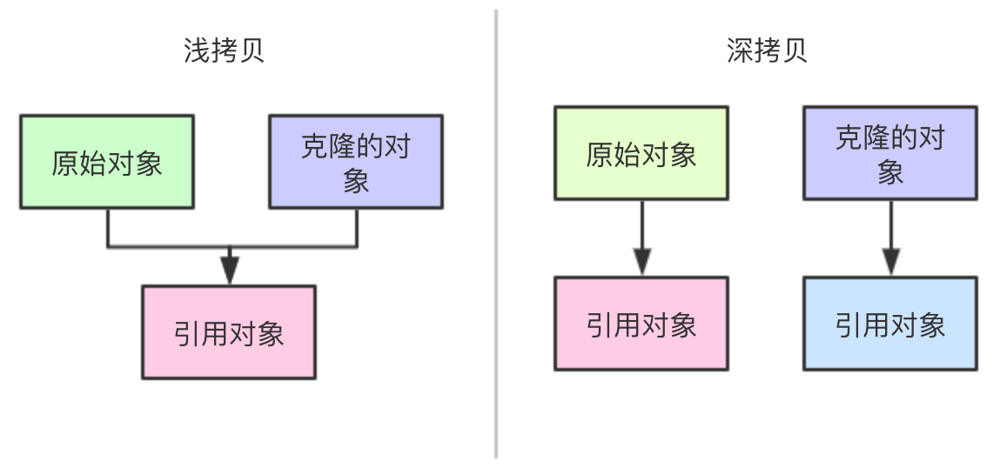

# 学习浅拷贝和深拷贝的正确方式

> 【推荐】慎用`Object`的`clone`方法来拷贝对象。

> 说明：对象`clone`方法默认是浅拷贝，若想实现深拷贝需覆写`clone`方法实现域对象的深度遍历式拷贝。

**什么是拷贝？**

> 克隆`(Clone)`在广义上是指利用生物技术由无性生殖产生与原原个体有完全相同基因组之后代的过程。

> 在园艺学上，克隆指通过营养繁殖产生的单一植株的后代，很多植物都是通过克隆这样的无性繁殖方式从单一植株获得大量的子代个体。

> 在生物学上，是指选择性地复制出一段`DNA`序列(分子克隆)、细胞(细胞克隆)或个体(个体克隆)。

> 克隆一个生物体意味着创造一个与原先的生物体具有完全一样的遗传信息的新生物体。

对象的拷贝，就是根据原来的对象“复制”一份属性、状态一致的新的对象。

**为什么需要拷贝呢？**

多线程环境中，如果我们不通过克隆构造新的对象，线程池中两个线程会公用同一个对象，对数据的修改将影响到其它线程。因此如果能够克隆一个新的对象，并且对新对象的修改不影响原始对象，就能实现我们期待的效果。

**什么是浅拷贝？浅拷贝和深拷贝的区别是什么？**

```java
protected native Object clone() throws CloneNotSupportedException;
```

该方法是创建对象的副本。这就意味着“副本”依赖于该对象的类型。

对于任何对象而言，一般来说下面的表达式成立：

`x.clone() != x`的结果为`true`。

`x.clone().getClass() == x.getClass()`的结果为`true`。

但是这些也不是强制的要求。

`x.clone().equals(x)`的结果也是`true`。这也不是强制要求。

按照惯例，返回对象应该通过调用`super.clone`函数来构造。如果一个类和它的所有父类(除了`Object`)都遵循这个约定，那么`x.clone().getClass() == x.getClass()`将成立。

按照惯例，返回的对象应该和原始对象是独立的。

为了实现这种独立性，后续应该在调用`super.clone`得到拷贝对象并返回之前，应该对内部深层次的可变对象创建副本并指向克隆对象的对应属性的引用。

如果一个类只包含基本类型的属性或者指向不可变对象的引用，这种情况下，`super.clone`返回的对象不需要被修改。

如果调用`clone`函数的类没有实现`Cloneable`接口将会抛出`CloneNotSupportedException`。

注意所有的数组对象都默认实现了`Cloneable`接口。

该函数会创建该类的新实例，并初始化所有属性对象。属性对象本身并不会自动调用`clone`。

因此此方法实现的是浅拷贝而不是深拷贝。

因此我们可以了解到，浅拷贝将返回该类的新的实例，该实例的引用类型对象共享。

深拷贝也会返回该类的新的实例，但是该实例的引用类型属性也是拷贝的新对象。

如果用一句话来描述，浅拷贝和深拷贝的主要区别在于对于引用类型是否共享。



> 浅拷贝：同一个文件夹的两个快捷方式，虽然是两个不同的快捷方式，但是指向的文件夹是同一个，不管是通过哪个快捷方式进入，对该文件夹下的文件修改，相互影响。

> 深拷贝：我们复制某个文件夹（含里面的内容）在另外一个目录进行粘贴，就可得到具有相同内容的新目录，对新文件夹修改不影响原始文件夹。

**深拷贝实现**

```java
/**
 * Gson方式实现深拷贝
 */
public static <T> T deepCloneByGson(T origin, Class<T> clazz) {
    Gson gson = new Gson();
    return gson.fromJson(gson.toJson(origin), clazz);
}
```

使用时直接调用封装的工具方法即可：

```java
@Test
public void withGson() {
    Order order = OrderMocker.mock();
    // gson序列化方式
    Order cloneOrder = CloneUtil.deepCloneByGson(order, Order.class);

    assertFalse(order == cloneOrder);
    assertFalse(order.getItemList() == cloneOrder.getItemList());
}
```

使用`JSON`序列化方式实现深拷贝的好处是，性能比`Java`序列化方式更好，更重要的是不要求序列化对象以及成员属性(嵌套)都要实现序列化接口。