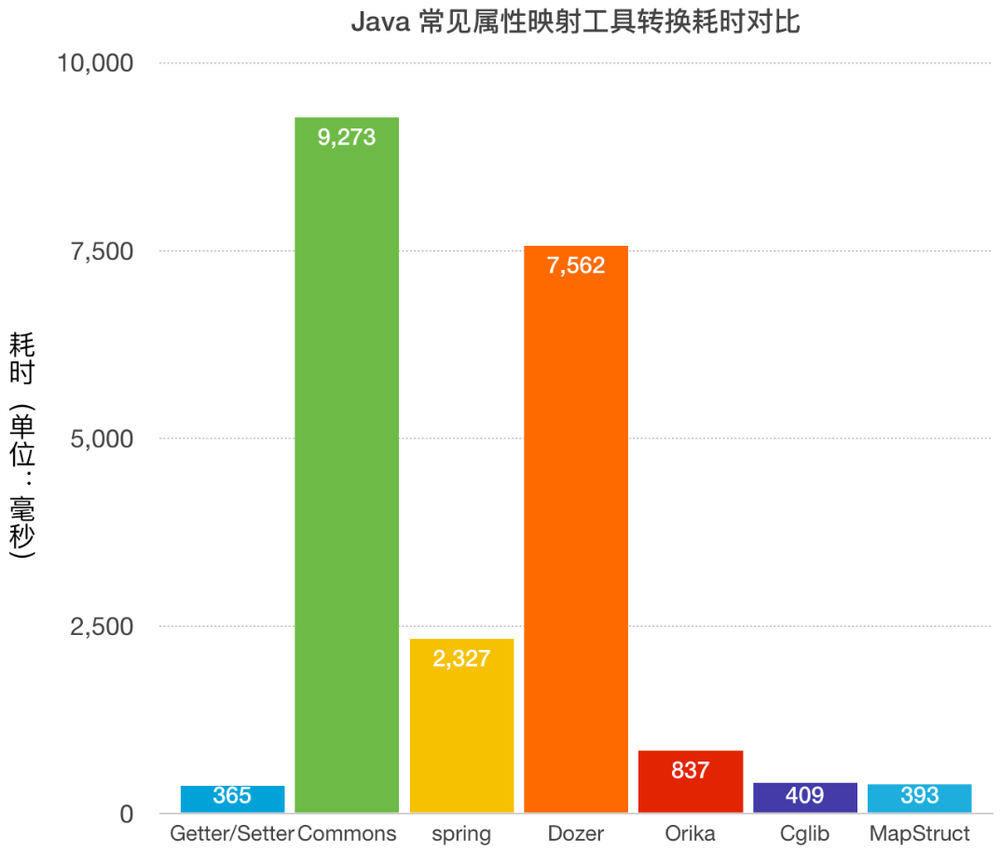

# Java 属性映射的正确姿势

前一节讲到项目为了更容易维护，易于拓展等原因会使用各种分层领域模型。在多层应用中，常需要对各种不同的分层对象进行转换，这就会存在一个非常棘手的问题即：编写不同的模型之间相互转换的代码非常麻烦。其中最常见和最简单的方式是编写对象属性转换函数，即普通的`Getter/Setter`方法。除此之外各种各种属性映射工具。

常见的`Java`属性映射工具有以下几种：

- org.apache.commons.beanutils.BeanUtils#copyProperties
- org.springframework.beans.BeanUtils#copyProperties(java.lang.Object, java.lang.Object)
- org.dozer.Mapper#map(java.lang.Object, java.lang.Class<T>)
- net.sf.cglib.beans.BeanCopier#copy
- ma.glasnost.orika.MapperFacade#map(S, D)
- mapstruct

采用字节码增强技术的`Java`属性转换工具和普通的`Getter/Setter`方法性能相差无几，甚至比`Getter/Setter`效率还高，反射的性能相对较差。

因此从性能来讲首推`Getter/Setter`方式(含`MapStruct`)，其次是`cglib`。