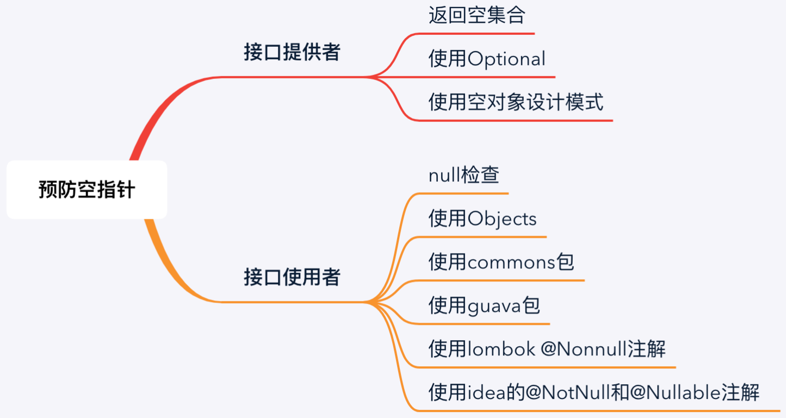

# 空指针引发的血案

> 【强制】`Object`的`equals`方法容易抛空指针异常，应使用常量或确定有值的对象来调用`equals`。

> 【推荐】防止`NPE`，是程序员的基本修养，注意`NPE`产生的场景:

> 返回类型为基本数据类型，`return`包装数据类型的对象时，自动拆箱有可能产生`NPE`。

> 反例：`public int f () { return Integer 对象}`，如果为`null`，自动解箱抛`NPE`。

> 数据库的查询结果可能为`null`。

> 集合里的元素即使`isNotEmpty`，取出的数据元素也可能为`null`。

> 远程调用返回对象时，一律要求进行空指针判断，防止`NPE`。

> 对于`Session`中获取的数据，建议进行`NPE`检查，避免空指针。

> 级联调用`obj.getA().getB().getC();`一连串调用，易产生`NPE`。

```java
/**
 * Thrown when an application attempts to use {@code null} in a
 * case where an object is required. These include:
 * <ul>
 * <li>Calling the instance method of a {@code null} object.
 * <li>Accessing or modifying the field of a {@code null} object.
 * <li>Taking the length of {@code null} as if it were an array.
 * <li>Accessing or modifying the slots of {@code null} as if it
 *     were an array.
 * <li>Throwing {@code null} as if it were a {@code Throwable}
 *     value.
 * </ul>
 * <p>
 * Applications should throw instances of this class to indicate
 * other illegal uses of the {@code null} object.
 *
 * {@code NullPointerException} objects may be constructed by the
 * virtual machine as if {@linkplain Throwable#Throwable(String,
 * Throwable, boolean, boolean) suppression were disabled and/or the
 * stack trace was not writable}.
 *
 * @author  unascribed
 * @since   JDK1.0
 */
public
class NullPointerException extends RuntimeException {
    private static final long serialVersionUID = 5162710183389028792L;

    /**
     * Constructs a {@code NullPointerException} with no detail message.
     */
    public NullPointerException() {
        super();
    }

    /**
     * Constructs a {@code NullPointerException} with the specified
     * detail message.
     *
     * @param   s   the detail message.
     */
    public NullPointerException(String s) {
        super(s);
    }
}
```

空指针发生的原因是应用需要一个对象时却传入了`null`，包含以下几种情况：

- 调用`null`对象的实例方法。
- 访问或者修改`null`对象的属性。
- 获取值为`null`的数组的长度。
- 访问或者修改值为`null`的二维数组的列时。
- 把`null`当做`Throwable`对象抛出时。

`Exception`分为两类一种是非受检异常即`java.lang.RuntimeException`以及其子类；而受检异常的抛出需要再普通函数或构造方法上通过`throws`声明。

`Error`代表严重的问题，不应该被程序`try-catch`。

**最常见的错误姿势**

```java
@Test
public void test() {
    Assertions.assertThrows(NullPointerException.class, () -> {
        List<UserDTO> users = new ArrayList<>();
        users.add(new UserDTO(1L, 3));
        users.add(new UserDTO(2L, null));
        users.add(new UserDTO(3L, 3));
        send(users);
    });
}

// 第 1 处
private void send(List<UserDTO> users) {
    for (UserDTO userDto : users) {
        doSend(userDto);
    }
}

private static final Integer SOME_TYPE = 2;

private void doSend(UserDTO userDTO) {
    String target = "default";
    // 第 2 处
    if (!userDTO.getType().equals(SOME_TYPE)) {
        target = getTarget(userDTO.getType());
    }
    System.out.println(String.format("userNo:%s, 发送到%s成功", userDTO, target));
}

private String getTarget(Integer type) {
    return type + "号基地";
}
```

在第`1`处，如果集合为`null`则会抛空指针。

在第`2`处，如果`type`属性为`null`则会抛空指针异常，导致后续都发送失败。

大家看这个例子觉得很简单，看到输入的参数有`null`本能地就会考虑空指针问题，但是自己写代码时你并不知道上游是否会有`null`。

**无结果仍返回对象**

```java
/**
 * 根据订单编号查询订单
 *
 * @param orderNo 订单编号
 * @return 订单
 */
public Order getByOrderNo(String orderNo) {

    if (StringUtils.isEmpty(orderNo)) {
        return new Order();
    }
    // 查询order
    return doGetByOrderNo(orderNo);
}
```

上层判断返回值不为`null`，上层就放心大胆得调用实例函数，导致线上报空指针，就造成了线上`BUG`。

**自动拆箱导致空指针**

如果我们下面的`GoodCreateDTO`是我们自己服务的对象，而`GoodCreateParam`是我们调用服务的参数对象。

```java
@Data
public class GoodCreateDTO {
    private String title;

    private Long price;

    private Long count;
}
```

```java
@Data
public class GoodCreateParam implements Serializable {
    private static final long serialVersionUID = -560222124628416274L;

    private String title;

    private long price;

    private long count;
}
```

其中`GoodCreateDTO`的`count`属性在我们系统中是非必传参数，本系统可能为`null`。

如果我们没有拉取源码的习惯，直接通过前面的转换工具类去转换。

我们潜意识会认为外部接口的对象类型也都是包装类型，这时候很容易因为转换出现`NPE`而导致线上`BUG`。

```java
public class GoodCreateConverter {

    public static GoodCreateParam convertToParam(GoodCreateDTO goodCreateDTO) {
        if (goodCreateDTO == null) {
            return null;
        }
        GoodCreateParam goodCreateParam = new GoodCreateParam();
        goodCreateParam.setTitle(goodCreateDTO.getTitle());
        goodCreateParam.setPrice(goodCreateDTO.getPrice());
        goodCreateParam.setCount(goodCreateDTO.getCount());
        return goodCreateParam;
    }
}
```

当转换器执行到`goodCreateParam.setCount(goodCreateDTO.getCount());`会自动拆箱会报空指针。

当`GoodCreateDTO`的`count`属性为`null`时，自动拆箱将报空指针。

我们作为使用方调用如下的二方服务接口：

```java
public Boolean someRemoteCall();
```

然后自以为对方肯定会返回`TRUE`或`FALSE`，然后直接拿来作为判断条件或者转为基本类型，如果返回的是`null`，则会报空指针异常：

```java
if (someRemoteCall()) {
    // 业务代码
}
```

大家看示例的时候可能认为这种情况很简单，自己开发的时候肯定会注意，但是往往事实并非如此。希望大家可以掌握常见的可能发生空指针场景，在开发时注意预防。

**分批调用合并结果时空指针**

因为某些批量查询的二方接口在数据较大时容易超时，因此可以分为小批次调用。

下面封装一个将`List`数据拆分成每`size`个一批数据，去调用`function RPC`接口，然后将结果合并。

```java
public static <T, V> List<V> partitionCallList(List<T> dataList, int size, Function<List<T>, List<V>> function) {
    if (CollectionUtils.isEmpty(dataList)) {
        return new ArrayList<>(0);
    }
    Preconditions.checkArgument(size > 0, "size 必须大于0");
    return Lists.partition(dataList, size)
            .stream()
            .map(function)
            .reduce(new ArrayList<>(),
                (resultList1, resultList2) -> {
                    resultList1.addAll(resultList2);
                    return resultList1;
                });
}
```

设想一下，如果某一个批次请求无数据，不是返回空集合而是`null`，会怎样？

很不幸，又一个空指针异常。

此时要根据具体业务场景来判断如何处理这里可能产生的空指针异常。



`Optional`是`Java 8`引入的特性，返回一个`Optional`则明确告诉使用者结果可能为空：

```java
public Optional<Order> getByOrderId(Long orderId) {
    return Optional.ofNullable(doGetByOrderId(orderId));
}
```

> 可以进行参数检查，对不满足的条件抛出异常。

直接在使用前对不能为`null`的和不满足业务要求的条件进行检查，是一种最简单最常见的做法。

通过防御性参数检测，可以极大降低出错的概率，提高程序的健壮性：

```java
@Override
public void updateOrder(OrderUpdateParam orderUpdateParam) {
    checkUpdateParam(orderUpdateParam);
    doUpdate(orderUpdateParam);
}

private void checkUpdateParam(OrderUpdateParam orderUpdateParam) {
    if (orderUpdateParam == null) {
        throw new IllegalArgumentException("参数不能为空");
    }
    Long id = orderUpdateParam.getId();
    String name = orderUpdateParam.getName();
    if (id == null) {
        throw new IllegalArgumentException("id不能为空");
    }
    if (name == null) {
        throw new IllegalArgumentException("name不能为空");
    }
}
```

`JDK`和各种开源框架中可以找到很多这种模式，`java.util.concurrent.ThreadPoolExecutor#execute`就是采用这种模式。

```java
public void execute(Runnable command) {
    if (command == null)
        throw new NullPointerException();
}
```