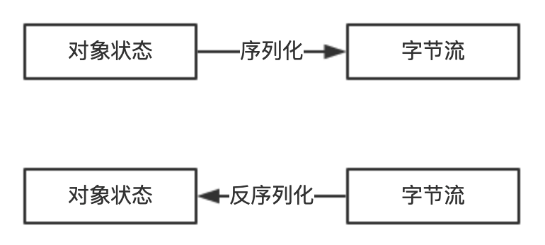

# Java 序列化引发的血案

> 【强制】当序列化类新增属性时，请不要修改`serialVersionUID`字段，以避免反序列失败；如果完全不兼容升级，避免反序列化混乱，那么请修改`serialVersionUID`值。

> 说明：注意`serialVersionUID`值不一致会抛出序列化运行时异常。

**序列化与反序列化**

序列化是将内存中的对象信息转化成可以存储或者传输的数据到临时或永久存储的过程。而反序列化正好相反，是从临时或永久存储中读取序列化的数据并转化成内存对象的过程。



如果要实现`Java`远程方法调用，就需要将调用结果通过网路传输给调用方，如果调用方和服务提供方不在一台机器上就很难共享内存，就需要将`Java`对象进行传输。而想要将`Java`中的对象进行网络传输或存储到文件中，就需要将对象转化为二进制字节流，这就是所谓的序列化。存储或传输之后必然就需要将二进制流读取并解析成`Java`对象，这就是所谓的反序列化。

序列化的主要目的是：方便存储到文件系统、数据库系统或网络传输等。

实际开发中常用到序列化和反序列化的场景有：

- 远程方法调用`(RPC)`的框架里会用到序列化。
- 将对象存储到文件中时，需要用到序列化。
- 将对象存储到缓存数据库`(Redis)`时需要用到序列化。
- 通过序列化和反序列化的方式实现对象的深拷贝。

**Java原生序列化**

```java
public interface Serializable {
}
```

`Java`原生序列化需要实现`Serializable`接口。序列化接口不包含任何方法和属性等，它只起到序列化标识作用。

一个类实现序列化接口则其子类型也会继承序列化能力，但是实现序列化接口的类中有其他对象的引用，则其他对象也要实现序列化接口。序列化时如果抛出`NotSerializableException`异常，说明该对象没有实现`Serializable`接口。

每个序列化类都有一个叫`serialVersionUID`的版本号，反序列化时会校验待反射的类的序列化版本号和加载的序列化字节流中的版本号是否一致，如果序列化号不一致则会抛出`InvalidClassException`异常。

强烈推荐每个序列化类都手动指定其`serialVersionUID`，如果不手动指定，那么编译器会动态生成默认的序列化号，因为这个默认的序列化号和类的特征以及编译器的实现都有关系，很容易在反序列化时抛出`InvalidClassException`异常。建议将这个序列化版本号声明为私有，以避免运行时被修改。

实现序列化接口的类可以提供自定义的函数修改默认的序列化和反序列化行为。

自定义序列化方法：

```java
private void writeObject(ObjectOutputStream out) throws IOException;
```

自定义反序列化方法：

```java
private void readObject(ObjectInputStream in) throws IOException, ClassNotFoundException;
```

通过自定义这两个函数，可以实现序列化和反序列化不可序列化的属性，也可以对序列化的数据进行数据的加密和解密处理。