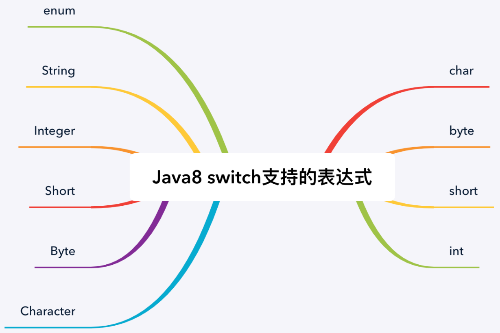

# 当 switch 遇到空指针

> 【强制】当`switch`括号内的变量类型为`String`并且此变量为外部参数时，必须先进行`null`判断。

`switch`的表达式必须是`char, byte, short, int, Character, Byte, Short, Integer, String`，或者`enum`类型，否则会发生编译错误。

`switch`语句必须满足以下条件，否则会出现编译错误：

- 与`switch`语句关联的每个`case`都必须和`switch`的表达式的类型一致。
- 如果`switch`表达式是枚举类型，`case`常量也必须是枚举类型。
- 不允许同一个`switch`的两个`case`常量的值相同。
- 和`switch`语句关联的常量不能为`null`。
- 一个`switch`语句最多有一个`default`标签。

> `switch`语句执行的时候，首先将执行`switch`的表达式。如果表达式为`null`，则会抛出`NullPointerException`，整个`switch`语句的执行将被中断。