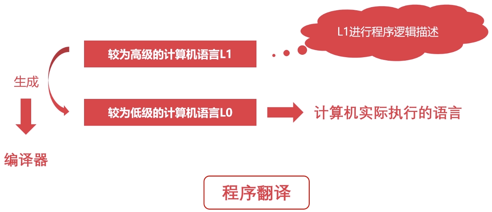
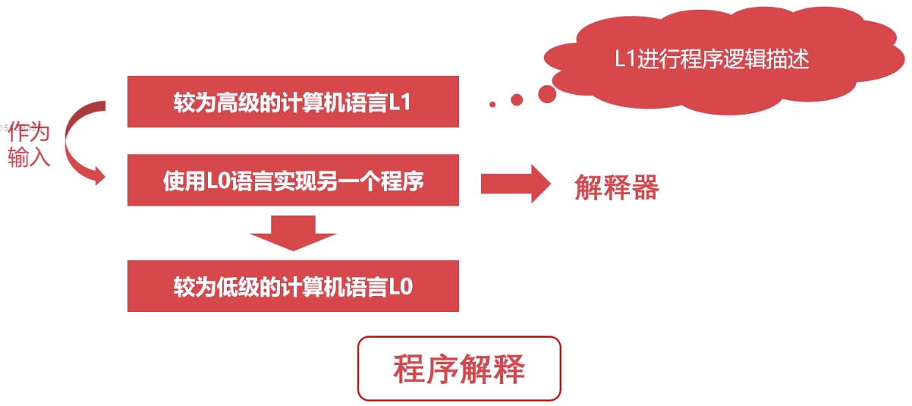

# 计算机的层次与编程语言

## 程序翻译

代表语言：`C/C++`、`Object-C`、`Golang`。

## 程序解释

代表语言：`Python`、`PHP`、`JavaScript`。

## 翻译 + 解释

代表语言：`Java`、`C#`。

## 计算机的层级

| 层级 | 特点 |
| ---- | ---- |
| 硬件逻辑层 | 门、触发器等逻辑电路组成 |
| 微程序机器层 | 微指令集，微指令所组成的微程序直接交由硬件执行 |
| 传统机器层 | `CPU`指令集(机器指令)，与硬件直接相关，不同架构的`CPU`使用不同的`CPU`指令集 |
| 操作系统层 | 向上提供简易操作界面，向下对接指令系统，管理硬件资源，是软件和硬件之间的适配层 |
| 汇编语言层 | 汇编语言，汇编器将其翻译成可直接执行的机器语言 |
| 高级语言层 | 广大程序员所接受的高级语言 |
| 应用层 | 各种应用软件 |