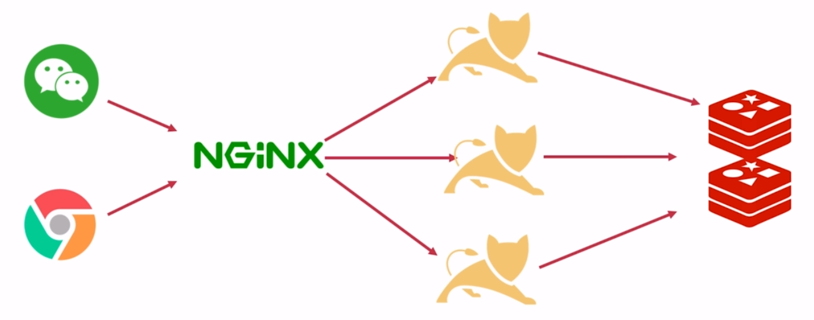

# 项目架构

## 部署架构

- 整个系统交由`NGINX`托管，`NGINX`转发`api`请求到`Tomcat`。

- `Tomcat`分布式部署，`NGINX`负载均衡。

- 如果数据缓存，从`Redis`中查询数据；如果数据未缓存，从`MySQL`中查询数据。

## 微服务架构

### 阿里系

- 服务治理：`Dubbo`
- 服务注册中心：`Zookeeper`
- 基础框架：`SpringMVC`或`SpringBoot`

### Spring Cloud 系

- 服务治理：`Spring Cloud`
- 服务注册中心：`Netflix Eureka`
- 基础框架：`SpringBoot`

## 分布式系统

旨在支持应用程序和服务的开发，可以利用物理架构由多个自治的处理元素，不共享主内存，但通过网络发送消息合作。

特点：

- 多节点
- 消息通信
- 不共享内存

### 分布式与集群

- 分布式强调不同功能模块的节点
- 集群指相同业务功能的节点

## 分布式系统下的 Session

水平扩展，做集群。

垂直扩展，拆分服务，分布式。

`IP`哈希：存在隐患，当服务宕机时不可用。

使用`Redis`存储`Session`，以达到`Session`共享。