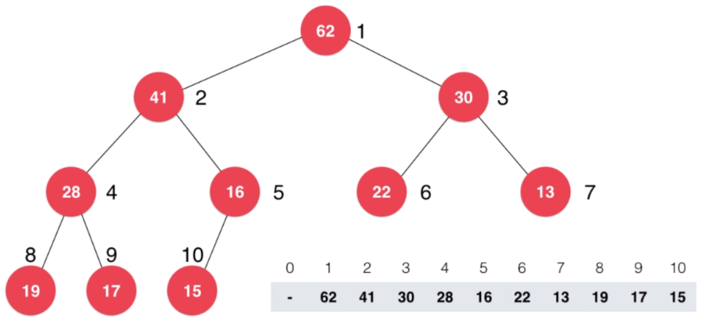

# 堆和堆排序

## 为什么使用堆？

**什么是优先队列？**

普通队列：先进先出，后进后出。

优先队列：出对顺序和入队顺序无关，和优先级有关。

**为什么使用优先队列？**

在`N`个元素中选出前`M`个元素。

排序：`NlogN`。

使用优先队列：`NlogM`。

**优先队列主要操作**

入队；出队(取出优先级最高的元素)。

## 堆的基本存储

**二叉堆**


最大堆：任何一个节点都不大于它父亲节点的完全二叉树。

> 完全二叉树：叶子节点只可能在最大的两层出现。

**用数组存储二叉堆**



使用数组，从下标`1`开始，存储整个二叉堆。

```text
i.parent -> i / 2;
i.left_child -> 2 * i;
i.right_child -> 2 * i + 1;
```

```cpp
/**
 * 最大堆
 */
template<typename T>
class MaxHeap {

private:
    T* data;
    int capacity;
    int count;

    /** 向上调整 */
    void shiftUp(int k) {
        while (k > 1 && this->data[k] > this->data[k / 2]) {
            swap(this->data[k], this->data[k / 2]);
            k /= 2;
        }
    }

    /** 向下调整 */
    void shiftDown(int k) {
        while (k * 2 <= count) {
            int j = k * 2;
            if (j + 1 <= count && data[j + 1] > data[j]) {
                j += 1;
            }

            if (data[k] >= data[j]) {
                break;
            }
            swap(data[k], data[j]);
            k = j;
        }
    }

public:
    MaxHeap(int capacity) {
        this->data = new T[capacity + 1];
        this->capacity = capacity;
        this->count = 0;
    }

    ~MaxHeap() {
        delete[] data;
    }

    int size() {
        return count;
    }

    bool isEmpty() {
        return count == 0;
    }

    void insert(T item) {
        assert(count + 1 <= capacity);
        this->data[count + 1] = item;
        count ++;
        this->shiftUp(count);
    }

    T extractMax() {
        assert(count > 0);
        T ret = data[1];
        swap(data[1], data[count]);
        count --;
        this->shiftDown(1);
        return ret;
    }
};
```

## 堆排序

```cpp
template<typename T>
void heapSort(T* arr, int n) {
    MaxHeap<T> heap = MaxHeap<T>(n);
    for (int i = 0; i < n; i ++) {
        heap.insert(arr[i]);
    }
    for (int i = n - 1; i >= 0; i --) {
        arr[i] = heap.extractMax();
    }
}
```

## Heapify

通过数组可直接构造堆，而无需每次插入元素。

```cpp
MaxHeap(T *arr, int n) {
    this->data = new T[n + 1];
    this->capacity = n;
    for (int i = 0; i < n; i ++) {
        this->data[i + 1] = arr[i];
    }
    this->count = n;
    for (int i = count / 2; i > 0; i --) {
        this->shiftDown(i);
    }
}

template<typename T>
void heapSort(T* arr, int n) {
    MaxHeap<T> heap = MaxHeap<T>(arr, n);
    for (int i = n - 1; i >= 0; i --) {
        arr[i] = heap.extractMax();
    }
}
```