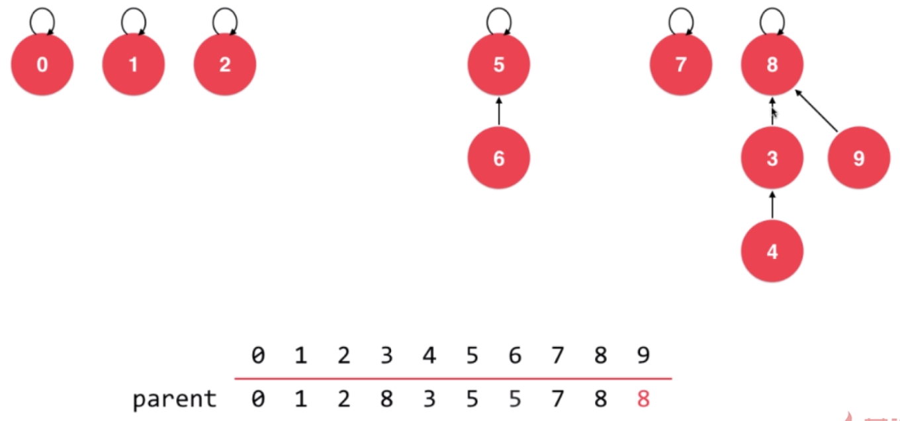

# 并查集

高效解决连接问题，网络中节点间的连接状态(用户网络)。

对于一组数据，主要支持两个动作：

- union(p, q)
- find(p)

## Quick Find


值相同的数据表示相连，图中`0/2/4/6/8`相互连接，`1/3/5/7/9`相互连接。

```cpp
class UnionFind {
private:
    int* id;
    int count;

public:
    UnionFind(int n) {
        this->count = n;
        this->id = new int[n];
        for (int i = 0; i < n; i ++) {
            this->id[i] = i;
        }
    }

    ~UnionFind() {
        delete[] id;
    }

    int find(int p) {
        assert(p >= 0 && p < this->count);
        return id[p];
    }

    bool isConnected(int p, int q) {
        return find(p) == find(q);
    }

    void unionElements(int p, int q) {
        int pId = find(p);
        int qId = find(q);

        if (pId == qId) {
            return;
        }

        for (int i = 0; i < this->count; i ++) {
            if (this->id[i] == pId) {
                this->id[i] = qId;
            }
        }
    }
};
```

## Quick Union



通过`parent`表示元素的连接关系，常用的实现方式。

```cpp
class UnionFind {
private:
    int* parent;
    int count;

public:
    UnionFind(int n) {
        this->count = n;
        this->parent = new int[n];
        for (int i = 0; i < n; i ++) {
            this->parent[i] = i;
        }
    }

    ~UnionFind() {
        delete[] parent;
    }

    int find(int p) {
        assert(p >= 0 && p < this->count);
        while (p != parent[p]) {
            p = parent[p];
        }
        return p;
    }

    bool isConnected(int p, int q) {
        return find(p) == find(q);
    }

    void unionElements(int p, int q) {
        int pRoot = find(p);
        int qRoot = find(q);

        if (pRoot == qRoot) {
            return;
        }

        parent[pRoot] = qRoot;
    }
};
```

## 优化

```cpp
class UnionFind {
private:
    int* parent;
    /** rank[i] 表示以 i 为根的树的层数 */
    int* rank;
    int count;

public:
    UnionFind(int n) {
        count = n;
        parent = new int[n];
        rank = new int[n];
        for (int i = 0; i < n; i ++) {
            parent[i] = i;
            rank[i] = 1;
        }
    }

    ~UnionFind() {
        delete[] parent;
        delete[] rank;
    }

    int find(int p) {
        assert(p >= 0 && p < count);
        while (p != parent[p]) {
            parent[p] = parent[parent[p]];
            p = parent[p];
        }
        return p;
    }

    bool isConnected(int p, int q) {
        return find(p) == find(q);
    }

    void unionElements(int p, int q) {
        int pRoot = find(p);
        int qRoot = find(q);

        if (pRoot == qRoot) {
            return;
        }

        if (rank[pRoot] < rank[qRoot]) {
            parent[pRoot] = qRoot;
        } else if (rank[qRoot] < rank[pRoot]) {
            parent[qRoot] = pRoot;
        } else {
            parent[pRoot] = qRoot;
            rank[qRoot] += 1;
        }
    }
};
```