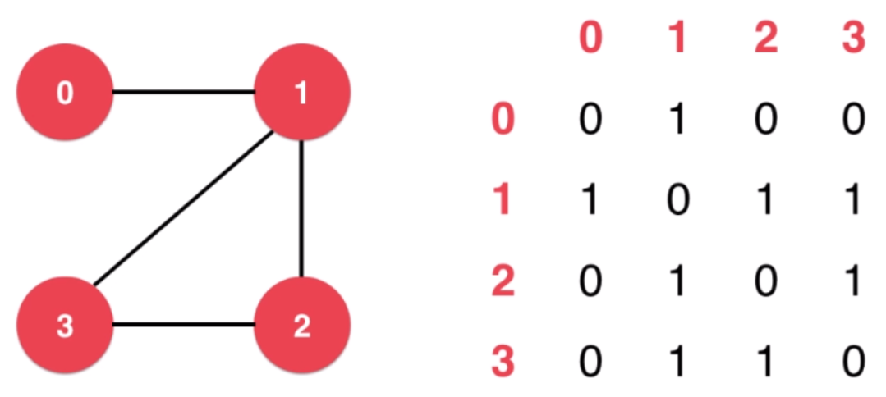
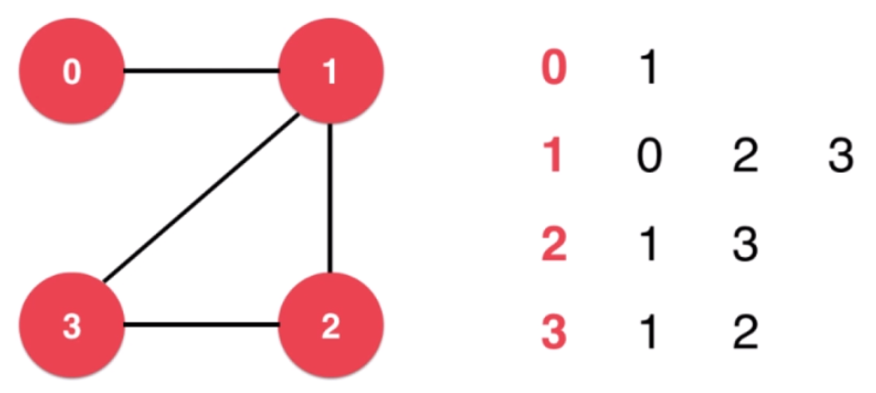
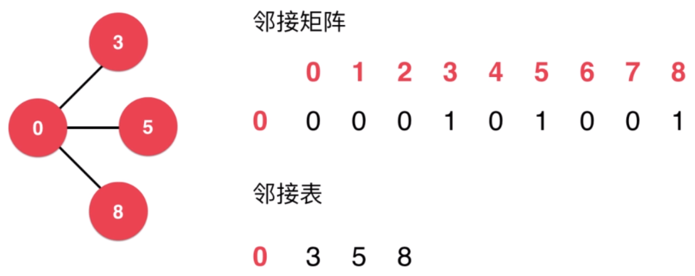

# 图论

## 图的分类

无向图：边没有方向。

有向图：边有方向。

无权图：边不带权值。

有权图：边带权值。

## 图的表示

邻接矩阵：通过矩阵内的`0/1`表示各节点之间的连接关系。适合表示稠密图。



```cpp
/**
 * 稠密图 邻接矩阵
 */
class DenseGraph {
private:
    /** n 点数 m 边数 */
    int n, m;
    /** 是否是有向图 */
    bool directed;
    /** 邻接矩阵 */
    vector<vector<bool>> g;

public:
    DenseGraph(int n, bool directed) {
        this->n = n;
        this->m = 0;
        this->directed = directed;
        for (int i = 0; i < n; i ++) {
            this->g.emplace_back(n, false);
        }
    }

    int V() {
        return n;
    }

    int E() {
        return m;
    }

    void addEdge(int v, int w) {
        assert(v >= 0 && v < n);
        assert(w >= 0 && w < n);

        if (hasEdge(v, w)) {
            return;
        }

        g[v][w] = true;
        if (!directed) {
            g[w][v] = true;
        }
        m ++;
    }

    bool hasEdge(int v, int w) {
        assert(v >= 0 && v < n);
        assert(w >= 0 && w < n);
        return g[v][w];
    }
};
```

邻接表：通过链表，表示该节点到各个节点之间的连接关系。适合表示稀疏图。



```cpp
/**
 * 稀疏图 邻接表
 */
class SparseGraph {
private:
    /** n 点数 m 边数 */
    int n, m;
    /** 是否是有向图 */
    bool directed;
    /** 邻接表 */
    vector<vector<int>> g;

public:
    SparseGraph(int n, bool directed) {
        this->n = n;
        this->m = 0;
        this->directed = directed;
        for (int i = 0; i < n; i ++) {
            this->g.emplace_back();
        }
    }

    int V() {
        return n;
    }

    int E() {
        return m;
    }

    void addEdge(int v, int w) {
        assert(v >= 0 && v < n);
        assert(w >= 0 && w < n);

        g[v].push_back(w);
        if (v != w && !directed) {
            g[w].push_back(v);
        }
        m ++;
    }

    bool hasEdge(int v, int w) {
        assert(v >= 0 && v < n);
        assert(w >= 0 && w < n);

        for (int i : g[v]) {
            if (i == w) {
                return true;
            }
        }
        return false;
    }
};
```

## 相邻节点迭代器

邻接表方式易于实现遍历相邻节点。



邻接表迭代器：

```cpp
class adjIterator {
private:
    SparseGraph& G;
    int v;
    int index;
public:
    adjIterator(SparseGraph& graph, int v): G(graph) {
        this->v = v;
        this->index = 0;
    }

    int begin() {
        index = 0;
        if (!G.g[v].empty()) {
            return G.g[v][index];
        }
        return -1;
    }

    int next() {
        index ++;
        if (index < G.g[v].size()) {
            return G.g[v][index];
        }
        return -1;
    }

    bool end() {
        return index >= G.g[v].size();
    }
};
```

邻接矩阵迭代器：

```cpp
class adjIterator {
private:
    DenseGraph& G;
    int v;
    int index;
public:
    adjIterator(DenseGraph& graph, int v): G(graph) {
        this->v = v;
        this->index = 0;
    }

    int begin() {
        int begin = -1;
        return next();
    }

    int next() {
        for (index += 1; index < G.V(); index ++) {
            if (G.g[v][index]) {
                return index;
            }
        }
        return -1;
    }

    bool end() {
        return index >= G.V();
    }
};
```