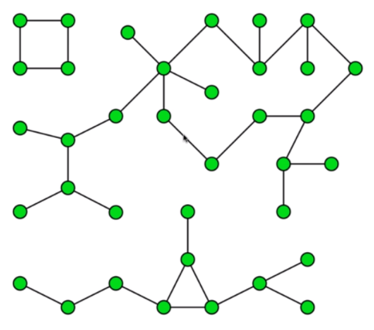

# 图论

## 图的分类

无向图：边没有方向。

有向图：边有方向。

无权图：边不带权值。

有权图：边带权值。

## 图的表示

邻接矩阵：通过矩阵内的`0/1`表示各节点之间的连接关系。适合表示稠密图。


```cpp
/**
 * 稠密图 邻接矩阵
 */
class DenseGraph {
private:
    /** n 点数 m 边数 */
    int n, m;
    /** 是否是有向图 */
    bool directed;
    /** 邻接矩阵 */
    vector<vector<bool>> g;

public:
    DenseGraph(int n, bool directed) {
        this->n = n;
        this->m = 0;
        this->directed = directed;
        for (int i = 0; i < n; i ++) {
            this->g.emplace_back(n, false);
        }
    }

    int V() {
        return n;
    }

    int E() {
        return m;
    }

    void addEdge(int v, int w) {
        assert(v >= 0 && v < n);
        assert(w >= 0 && w < n);

        if (hasEdge(v, w)) {
            return;
        }

        g[v][w] = true;
        if (!directed) {
            g[w][v] = true;
        }
        m ++;
    }

    bool hasEdge(int v, int w) {
        assert(v >= 0 && v < n);
        assert(w >= 0 && w < n);
        return g[v][w];
    }
};
```

邻接表：通过链表，表示该节点到各个节点之间的连接关系。适合表示稀疏图。


```cpp
/**
 * 稀疏图 邻接表
 */
class SparseGraph {
private:
    /** n 点数 m 边数 */
    int n, m;
    /** 是否是有向图 */
    bool directed;
    /** 邻接表 */
    vector<vector<int>> g;

public:
    SparseGraph(int n, bool directed) {
        this->n = n;
        this->m = 0;
        this->directed = directed;
        for (int i = 0; i < n; i ++) {
            this->g.emplace_back();
        }
    }

    int V() {
        return n;
    }

    int E() {
        return m;
    }

    void addEdge(int v, int w) {
        assert(v >= 0 && v < n);
        assert(w >= 0 && w < n);

        g[v].push_back(w);
        if (v != w && !directed) {
            g[w].push_back(v);
        }
        m ++;
    }

    bool hasEdge(int v, int w) {
        assert(v >= 0 && v < n);
        assert(w >= 0 && w < n);

        for (int i : g[v]) {
            if (i == w) {
                return true;
            }
        }
        return false;
    }
};
```

## 相邻节点迭代器

邻接表方式易于实现遍历相邻节点。


邻接表迭代器：

```cpp
class adjIterator {
private:
    SparseGraph& G;
    int v;
    int index;
public:
    adjIterator(SparseGraph& graph, int v): G(graph) {
        this->v = v;
        this->index = 0;
    }

    int begin() {
        index = 0;
        if (!G.g[v].empty()) {
            return G.g[v][index];
        }
        return -1;
    }

    int next() {
        index ++;
        if (index < G.g[v].size()) {
            return G.g[v][index];
        }
        return -1;
    }

    bool end() {
        return index >= G.g[v].size();
    }
};
```

邻接矩阵迭代器：

```cpp
class adjIterator {
private:
    DenseGraph& G;
    int v;
    int index;
public:
    adjIterator(DenseGraph& graph, int v): G(graph) {
        this->v = v;
        this->index = 0;
    }

    int begin() {
        int begin = -1;
        return next();
    }

    int next() {
        for (index += 1; index < G.V(); index ++) {
            if (G.g[v][index]) {
                return index;
            }
        }
        return -1;
    }

    bool end() {
        return index >= G.V();
    }
};
```

## 深度优先遍历和连通分量



```cpp
template<typename Graph>
class Component {
private:
    /** 图 */
    Graph& G;
    /** 是否被访问过 */
    bool* visited;
    /** 连通分量 */
    int count;
    /** 并查集 */
    int* id;

    /** 深度优先遍历 */
    void DFS(int v) {
        visited[v] = true;
        id[v] = count;
        typename Graph::adjIterator adj(G, v);
        for (int i = adj.begin(); !adj.end(); i = adj.next()) {
            if (!visited[i]) {
                DFS(i);
            }
        }
    }

public:
    Component(Graph& graph): G(graph) {
        this->visited = new bool[G.V()];
        this->id = new int[G.V()];
        this->count = 0;
        for (int i = 0; i < G.V(); i ++) {
            this->visited[i] = false;
            this->id[i] = -1;
        }

        for (int i = 0; i < G.V(); i ++) {
            if (!visited[i]) {
                DFS(i);
                count ++;
            }
        }
    }

    ~Component() {
        delete[] visited;
        delete[] id;
    }

    bool isConnected(int v, int w) {
        assert(v >= 0 && v < G.V());
        assert(w >= 0 && w < G.V());
        return id[v] == id[w];
    }
};
```

## 寻路

```cpp
template<typename Graph>
class Path {
private:
    /** 图 */
    Graph& G;
    /** 起始节点 */
    int source;
    /** 是否被访问过 */
    bool* visited;
    /** 当前节点是从哪个节点访问来的 */
    int* from;

    /** 深度优先遍历 */
    void DFS(int v) {
        visited[v] = true;
        typename Graph::adjIterator adj(G, v);
        for (int i = adj.begin(); !adj.end(); i = adj.next()) {
            if (!visited[i]) {
                from[i] = v;
                DFS(i);
            }
        }
    }

public:
    Path(Graph& graph, int s): G(graph) {
        assert(s >= 0 && s < G.V());
        this->visited = new bool[G.V()];
        this->from = new int[G.V()];
        for (int i = 0; i < G.V(); i ++) {
            this->visited[i] = false;
            this->from[i] = -1;
        }
        this->source = s;

        DFS(this->source);
    }

    ~Path() {
        delete[] visited;
        delete[] from;
    }

    bool hasPath(int w) {
        assert(w >= 0 && w < G.V());
        return visited[w];
    }

    void path(int w, vector<int>& vec) {
        stack<int> s;
        int p = w;
        while (p != -1) {
            s.push(p);
            p = from[p];
        }
        vec.clear();
        while (!s.empty()) {
            vec.push_back(s.top());
            s.pop();
        }
    }
};
```

## 广度优先遍历和最短路径

```cpp
template<typename Graph>
class ShortestPath {
private:
    /** 图 */
    Graph& G;
    /** 起始节点 */
    int source;
    /** 是否被访问过 */
    bool* visited;
    /** 当前节点是从哪个节点访问来的 */
    int* from;
    /** 最短距离 */
    int* ord;

public:
    ShortestPath(Graph& graph, int s): G(graph) {
        assert(s >= 0 && s < G.V());
        this->visited = new bool[G.V()];
        this->from = new int[G.V()];
        this->ord = new int[G.V()];
        for (int i = 0; i < G.V(); i ++) {
            this->visited[i] = false;
            this->from[i] = -1;
            this->ord[i] = -1;
        }
        this->source = s;

        queue<int> q;
        q.push(source);
        visited[source] = true;

        while (!q.empty()) {
            int v = q.front();
            q.pop();

            typename Graph::adjIterator adj(G, v);
            for (int i = adj.begin(); !adj.end(); i = adj.next()) {
                if (!visited[i]) {
                    q.push(i);
                    visited[i] = true;
                    from[i] = v;
                    ord[i] = ord[v] + 1;
                }
            }
        }
    }

    ~ShortestPath() {
        delete[] visited;
        delete[] from;
        delete[] ord;
    }

    bool hasPath(int w) {
        assert(w >= 0 && w < G.V());
        return visited[w];
    }

    void path(int w, vector<int>& vec) {
        stack<int> s;
        int p = w;
        while (p != -1) {
            s.push(p);
            p = from[p];
        }
        vec.clear();
        while (!s.empty()) {
            vec.push_back(s.top());
            s.pop();
        }
    }

    int length(int w) {
        assert(w >= 0 && w < G.V());
        return ord[w];
    }
};
```