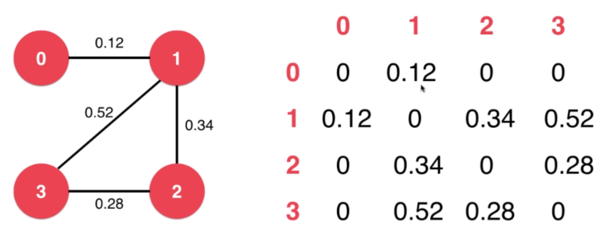
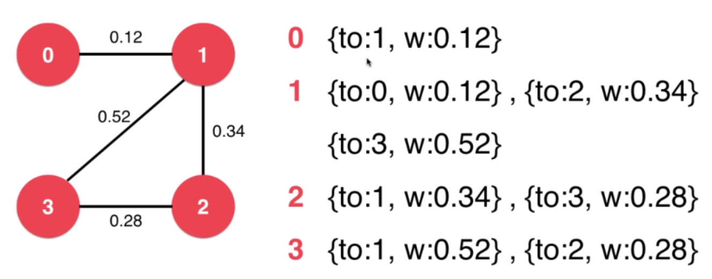
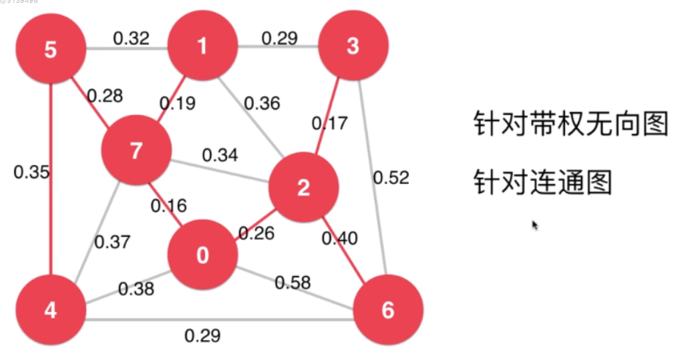

# 最小生成树

## 有权图

使用邻接矩阵存储有权图：



使用邻接表存储有权图：



```cpp
template<typename Weight>
class Edge {
private:
    int v, w;
    Weight weight;

public:
    Edge(int v, int w, Weight weight) {
        this->v = v;
        this->w = w;
        this->weight = weight;
    }

    int V() {
        return this->v;
    }

    int W() {
        return this->w;
    }

    Weight wt() {
        return this->weight;
    }

    /** 给定一个顶点, 返回另一个顶点 */
    int other(int x){
        assert( x == v || x == w );
        return x == v ? w : v;
    }

    bool operator<(Edge<Weight>& e) {
        return this->weight < e.wt();
    }

    bool operator<=(Edge<Weight>& e) {
        return this->weight <= e.wt();
    }

    bool operator>(Edge<Weight>& e) {
        return this->weight > e.wt();
    }

    bool operator>=(Edge<Weight>& e) {
        return this->weight >= e.wt();
    }

    bool operator==(Edge<Weight>& e) {
        return this->weight == e.wt();
    }
};

/**
 * 稠密图 邻接矩阵
 */
template<typename Weight>
class DenseGraph {
private:
    /** n 点数 m 边数 */
    int n, m;
    /** 是否是有向图 */
    bool directed;
    /** 邻接矩阵 */
    vector<vector<Edge<Weight>*>> g;

public:
    DenseGraph(int n, bool directed) {
        this->n = n;
        this->m = 0;
        this->directed = directed;
        for (int i = 0; i < n; i ++) {
            this->g.push_back(vector<Edge<Weight>*>(n, NULL));
        }
    }

    ~DenseGraph() {
        for (int i = 0; i < n; i ++) {
            for (int j = 0; j < n; j ++) {
                if (g[i][j] != NULL) {
                    delete g[i][j];
                }
            }
        }
    }

    int V() {
        return n;
    }

    int E() {
        return m;
    }

    void addEdge(int v, int w, Weight weight) {
        assert(v >= 0 && v < n);
        assert(w >= 0 && w < n);

        if (hasEdge(v, w)) {
            delete g[v][w];
            if (!directed) {
                delete g[w][v];
            }
            m --;
        }

        g[v][w] = new Edge<Weight>(v, w, weight);
        if (!directed) {
            g[w][v] = new Edge<Weight>(w, v, weight);
        }
        m ++;
    }

    bool hasEdge(int v, int w) {
        assert(v >= 0 && v < n);
        assert(w >= 0 && w < n);
        return g[v][w] != NULL;
    }

    class adjIterator {
    private:
        DenseGraph& G;
        int v;
        int index;
    public:
        adjIterator(DenseGraph& graph, int v): G(graph) {
            this->v = v;
            this->index = 0;
        }

        Edge<Weight>* begin() {
            int begin = -1;
            return next();
        }

        Edge<Weight>* next() {
            for (index += 1; index < G.V(); index ++) {
                if (G.g[v][index]) {
                    return G.g[v][index];
                }
            }
            return NULL;
        }

        bool end() {
            return index >= G.V();
        }
    };
};

/**
 * 稀疏图 邻接表
 */
template<typename Weight>
class SparseGraph {
private:
    /** n 点数 m 边数 */
    int n, m;
    /** 是否是有向图 */
    bool directed;
    /** 邻接表 */
    vector<vector<Edge<Weight>*>> g;

public:
    SparseGraph(int n, bool directed) {
        this->n = n;
        this->m = 0;
        this->directed = directed;
        for (int i = 0; i < n; i ++) {
            this->g.push_back(vector<Edge<Weight>*>());
        }
    }

    int V() {
        return n;
    }

    int E() {
        return m;
    }

    void addEdge(int v, int w, Weight weight) {
        assert(v >= 0 && v < n);
        assert(w >= 0 && w < n);

        g[v].push_back(new Edge<Weight>(v, w, weight));
        if (v != w && !directed) {
            g[w].push_back(new Edge<Weight>(w, v, weight));
        }
        m ++;
    }

    bool hasEdge(int v, int w) {
        assert(v >= 0 && v < n);
        assert(w >= 0 && w < n);

        for (int i : g[v]) {
            if (g[v][i]->other(v) == w) {
                return true;
            }
        }
        return false;
    }

    class adjIterator {
    private:
        SparseGraph& G;
        int v;
        int index;
    public:
        adjIterator(SparseGraph& graph, int v): G(graph) {
            this->v = v;
            this->index = 0;
        }

        Edge<Weight>* begin() {
            index = 0;
            if (!G.g[v].empty()) {
                return G.g[v][index];
            }
            return NULL;
        }

        Edge<Weight>* next() {
            index ++;
            if (index < G.g[v].size()) {
                return G.g[v][index];
            }
            return NULL;
        }

        bool end() {
            return index >= G.g[v].size();
        }
    };
};
```

## 最小生成树

找`V-1`条边，连接`V`个顶点，使得总权值最小，生成最小生成树。



**切分定理**

切分：把图中的节点分为两部分。

横切边：如果一个边的两个端点，属于切分不同的两部分，这个边称为横切边。

切分定理：给定任意切分，横切边中权值最小的边必然属于最小生成树。