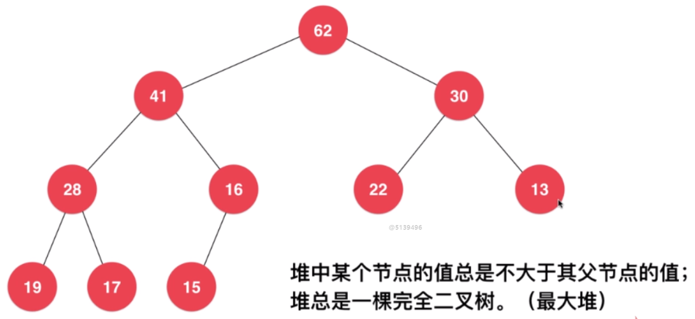
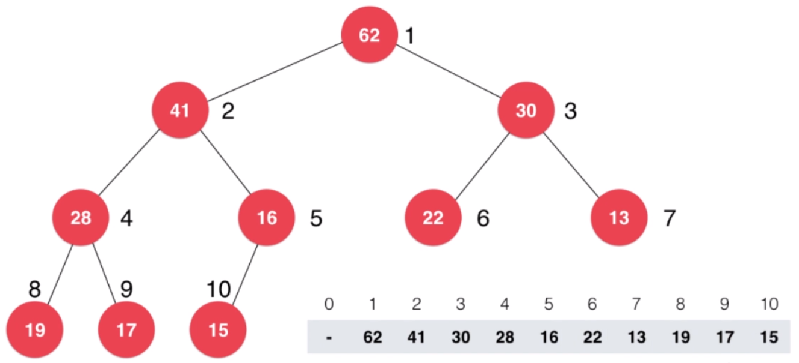

# 堆和堆排序

## 为什么使用堆？

**什么是优先队列？**

普通队列：先进先出，后进后出。

优先队列：出对顺序和入队顺序无关，和优先级有关。

**为什么使用优先队列？**

在`N`个元素中选出前`M`个元素。

排序：`NlogN`。

使用优先队列：`NlogM`。

**优先队列主要操作**

入队；出队(取出优先级最高的元素)。

## 堆的基本存储

**二叉堆**



最大堆：任何一个节点都不大于它父亲节点的完全二叉树。

> 完全二叉树：叶子节点只可能在最大的两层出现。

**用数组存储二叉堆**



使用数组，从下标`1`开始，存储整个二叉堆。

```text
i.parent -> i / 2;
i.left_child -> 2 * i;
i.right_child -> 2 * i + 1;
```

07:25