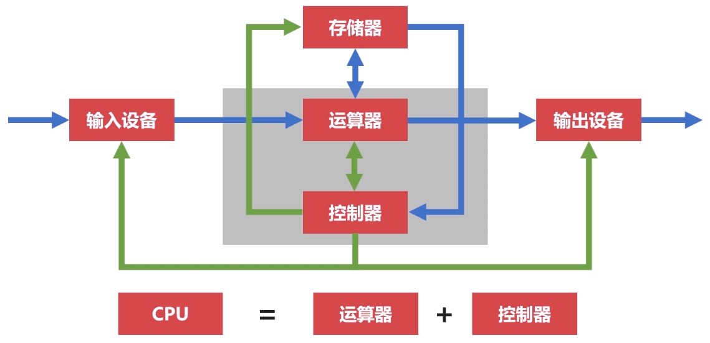
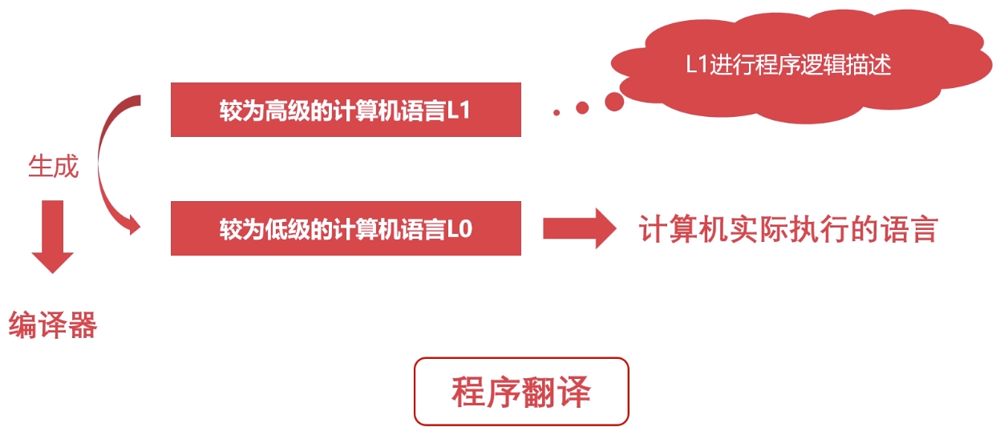

# 计算机组成原理之概述篇

## 计算机的发展历史

### 计算机发展的四个阶段

#### 第一阶段 [1946 ~ 1957] 电子管计算机


**历史**

第二次世界大战，英国为了解密德国海军的密文，设计了全世界第一台电子管计算机。

美国，埃尼阿克`(ENIAC)`计算机。战争中飞机、火箭的射击参数需要经过上千次计算，设计计算机为了使计算更准确。运算效率是手工运算的`20`万倍。

**特点**

- 集成度低，空间占用大。
- 功耗高，运算速度慢。
- 操作复杂，更换程序时需要重新接线。

#### 第二阶段 [1957 ~ 1964] 晶体管计算机


**历史**

贝尔实验室的三个科学家发明了晶体管。

`TX-0`：全世界第一台晶体管计算机，诞生于麻省理工学院林肯实验室。

`PDP-1`：当时性能最高的晶体管计算机，`4K`内存，每秒执行`20`万条指令，配备`512×512`的显示器。

**特点**

- 集成度相对较高，空间占用相对较小。
- 功耗相对较低，运行速度较快。
- 操作相对简单，交互更加方便。

#### 第三阶段 [1964 ~ 1980] 集成电路计算机


德州仪器的工程师发明了集成电路`(IC)`。

计算机变得更小，功耗变得更低，计算速度变得更快。

`IBM`计算机`7094`与`1401`主打功能不同，且相互无法兼容。推出兼容产品`System/360`，这就是操作系统的雏形。

#### 第四阶段 [1980 ~ 现在] 超大规模集成电路计算机


一个芯片集成了上百万的晶体管。

速度更快，体积更小，价格更低，更能被大众接受。

用途丰富：文本处理、表格处理、高交互的游戏与应用。

### 微型计算机的发展历史

#### 单核CPU

- [`1971` ~ `1973`] `500KHz`频率的微型计算机 (字长`8`位)
- [`1973` ~ `1978`] 高于`1MHz`频率的微型计算机 (字长`8`位)
- [`1978` ~ `1985`] `500MHz`频率的微型计算机 (字长`16`位)
- [`1985` ~ `2000`] 高于`1GHz`频率的微型计算机 (字长`32`位)
- [`2000` ~ 现在] 高于`2GHz`频率的微型计算机 (字长`64`位)

#### 摩尔定律

集成电路的性能，每`18 ~ 24`个月就会提升一倍。

频率越高，意味着更多的晶体管，更大的功耗，散热增加，烧毁芯片。

摩尔定律失效，进入多核CPU时代。

#### 多核CPU

`2005`年，`Intel`奔腾系列双核`CPU`、`AMD`速龙系列。

`2006`年，`Intel`酷睿四核`CPU`。

## 计算机的分类

### 超级计算机

功能最强、运算速度最快、存储容量最大的计算机，多用于国家高科技领域和尖端技术研究。

运算速度的单位是`TFlop/s`。

```
1TFlop/s = 每秒一万亿次浮点运算
```

`Intel(R) Core(TM) i7-6700K CPU @ 4.00GHz`：

```
44.87 GFlop/s = 0.04487 TFlop/s
```

### 大型计算机

具有高性能，可处理大量数据与复杂的运算，在大型机市场领域，`IBM`占据着很大的份额。

### 去IOE行动

- `I(IBM)`服务器提供商
- `O(Oracle)`数据库软件提供商
- `E(EMC)`存储设备提供商

`IOE`构成了从软件到硬件的商业数据库系统，代表了高维护费用的存储系统。

`2008`年，阿里巴巴提出去`IOE`概念：将海量数据从集中式的`Oracle`切换到分布式的`MySQL`集群，用普通的服务器代替价格昂贵的大型机。

### 普通服务器

不需要特殊的空调场所，具备不错的计算能力，可以完成较复杂的运算。

普通服务器已经代替了传统的大型机，成为大规模企业计算的中枢。

### 工作站

高端的通用微型计算机，提供比个人计算机更强大的性能。

类似于普通台式电脑，体积较大，但性能强劲。

### 微型计算机

又称为个人计算机，是最普通的一类计算机。

从构成的本质上来讲，个人计算机与其他类别计算机无异。

## 计算机的体系与结构

### 冯诺依曼体系

将程序指令和数据一起存储的计算机设计概念结构。

#### 体系诞生

早期计算机仅包含固定用途程序，改变程序需要更改计算机结构，重新设计电路。

故：将程序存储取来，并设计通用电路。

核心：存储程序指令，设计通用电路。

#### 计算机组成

1. 存储器：存储运行的程序，存储运行所需的数据。
2. 控制器：控制各组件工作。
3. 运算器：运行算数运算和逻辑运算。
4. 输入设备
5. 输出设备

现代计算机都是冯诺依曼计算机。

#### 功能

1. 能够把需要的程序和数据送至计算机中。
2. 能够长期记忆程序、数据、中间结果及最终运算结果的能力。
3. 能够具备算数、逻辑运算和数据传送等数据加工处理的能力。
4. 能够按照要求将处理结果输出给用户。

#### 瓶颈



冯诺依曼瓶颈：因`CPU`与存储器相分离，在`CPU`与存储器之间的数据流量成为了效率非常严重的限制，`CPU`经常空转等待数据传输。

### 现代计算机的结构

现代计算机在冯诺依曼体系结构基础上进行修改，解决`CPU`与存储设备之间的性能差异问题。


将存储器归入`CPU`，此处的存储器就是现在常说的`CPU`多级缓存，缓存是使用和`CPU`同样的`14`纳米工艺制造的硅半导体，成本高昂且非常占用`CPU`核心面积，故不能做成大容量。

## 计算机的层次与编程语言

### 程序翻译

代表语言：`C/C++`、`Object-C`、`Golang`。



### 程序解释

代表语言：`Python`、`PHP`、`JavaScript`。


### 翻译 + 解释

代表语言：`Java`、`C#`。


### 计算机的层级

| 层级 | 特点 |
| ---- | ---- |
| 硬件逻辑层 | 门、触发器等逻辑电路组成 |
| 微程序机器层 | 微指令集，微指令所组成的微程序直接交由硬件执行 |
| 传统机器层 | `CPU`指令集(机器指令)，与硬件直接相关，不同架构的`CPU`使用不同的`CPU`指令集 |
| 操作系统层 | 向上提供简易操作界面，向下对接指令系统，管理硬件资源，是软件和硬件之间的适配层 |
| 汇编语言层 | 汇编语言，汇编器将其翻译成可直接执行的机器语言 |
| 高级语言层 | 广大程序员所接受的高级语言 |
| 应用层 | 各种应用软件 |

## 计算机的速度单位

### 容量单位

计算机只认识`0/1`两种状态，在物理层面，使用高低电平记录信息。

- `0/1`称为`bit`(比特位)
- `1 Byte = 8 bit`
- `1 KB = 1024 Byte`
- `1 MB = 1024 KB`
- `1 GB = 1024 MB`
- `1 TB = 1024 GB`
- `1 PB = 1024 TB`
- `1 EB = 1024 PB`

**习题**

`1G`内存，可以存储多少字节的数据？可以存储多少比特数据？

> 

为什么网上买的移动硬盘`500G`，其实只有`465G`？

> 硬盘厂商使用`10`进制标记容量，进制为`1000`，而不是`1024`，所以容量小。
> 

### 速度单位

**网络速度**

为什么电信拉的`100M`光纤，测试峰值速度只有`12M`每秒？

> 网络常用单位为`Mbps`，`100 Mbps = 100 Mbit/s = 12.5MB/s`。

**CPU频率**

`CPU`的速度一般体现为`CPU`的时钟频率，`CPU`的时钟频率的单位一般是赫兹`(Hz)`。