# 计算机组成原理之组成篇

## 计算机的总线

### 总线的概述

总线解决不同设备之间的通信问题。

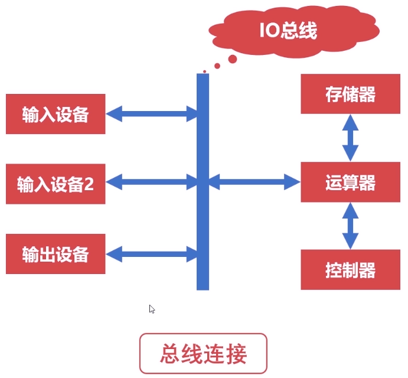

#### 片内总线

高集成度芯片内部的信息传输线。

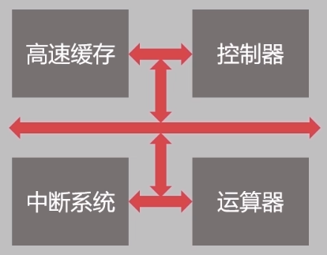

#### 系统总线

`CPU`、主内存、`IO`设备、各组件之间的信息传输线。

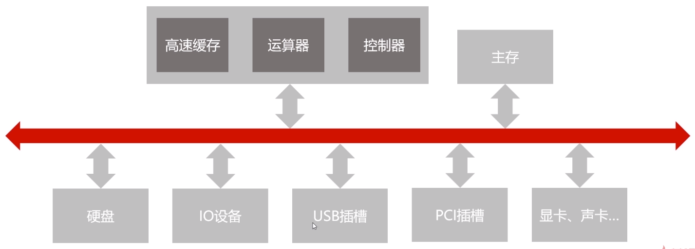

- 数据总线：双向传输各个部件的数据信息；数据总线的位数是数据总线的重要参数(一般与`CPU`位数相同)。
- 地址总线：指定源数据或目的数据在内存中的地址；地址总线的位数与存储单元有关；地址总线位数为`n`时，寻址范围为`0~2^n`。
- 控制总线：控制总线是用来发出各种控制信号的传输线；控制信号经由控制总线从一个组件发给另外一个组件；控制总线可以监视不同组件之间的状态(就绪/未就绪)。

### 总线的仲裁

#### 为什么需要仲裁

当多个设备就绪时，都想通过总线交换数据，就会产生冲突。

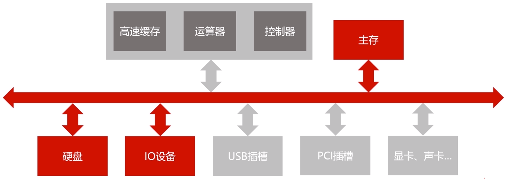

仲裁是为了解决总线使用权的冲突问题。

#### 链式查询

- 好处：电路复杂度低，仲裁方式简单。
- 坏处：优先级低的设备难以获得总线使用权。
- 坏处：对电路故障敏感。

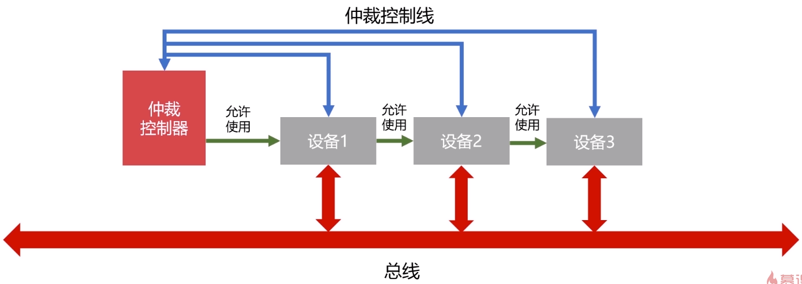

#### 计时器定时查询

- 仲裁控制器对设备编号并使用计数器累计计数。
- 接收到仲裁信号后，往所有设备发出计数值。
- 计数值与设备编号一致时则获得总线使用权。

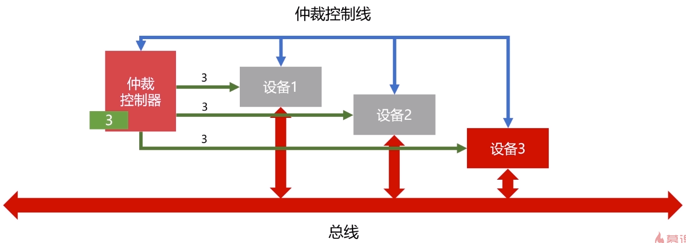

#### 独立请求

- 每个设备均有总线独立连接仲裁器。
- 设备可单独向仲裁器发送请求和接受请求。
- 当同时收到多个请求信号，仲裁器有权按优先级分配使用权。
- 好处：响应速度快，优先顺序可动态改变。
- 坏处：设备连线多，总线控制复杂。

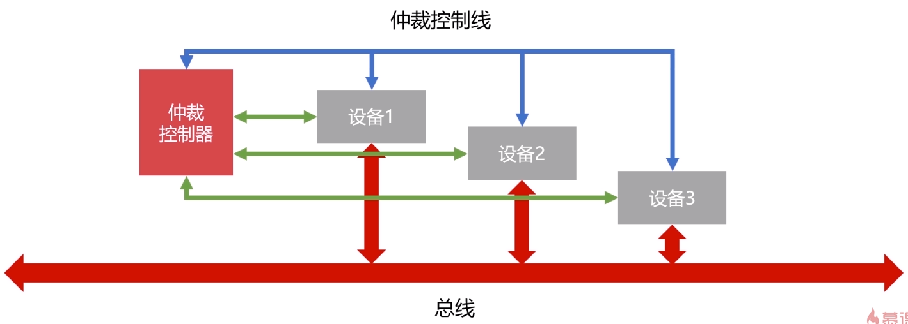

## 计算机的输入输出设备

### 常见的输入输出设备

- 字符输入设备：键盘。
- 图形输入设备：鼠标、数位板、扫描仪。
- 图像输出设备：显示器、打印机、投影仪。

### 输入输出接口的通用设计

- 数据线：是`IO`设备与主机之间进行数据交换的传送线；分为单向传输数据线、双向传输数据线。
- 状态线：`IO`设备状态向主机报告的信号线；查询设备是否已经正常连接并就绪；查询设备是否已经被占用。
- 命令线：`CPU`向设备发送命令的信号线；发送读写信号；发送启动停止信号。
- 设备选择线：主机选择`IO`设备进行操作的信号线；对连在总线上的设备进行选择。

### CPU与IO设备的通信

`CPU`速度与`IO`设备速度不一致。

#### 程序中断

当外围`IO`设备就绪时，向`CPU`发出中断信号，`CPU`有专门的电路响应中断信号。

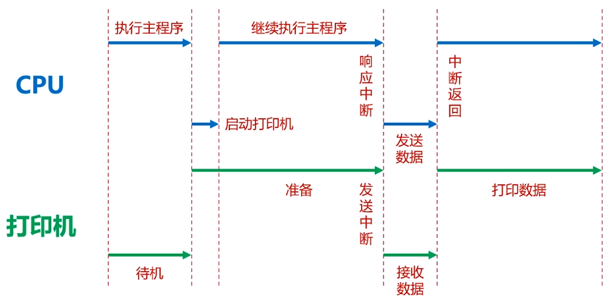

提供低速设备通知`CPU`的一种异步的方式；`CPU`可以高速运转同时兼顾低速设备的响应。

#### DMA(直接存储访问)

`DMA`直接连接主存与`IO`设备；`DMA`工作时不需要`CPU`的参与。

当主存与`IO`设备交换信息时，不需要中断`CPU`，可以提高`CPU`的效率。

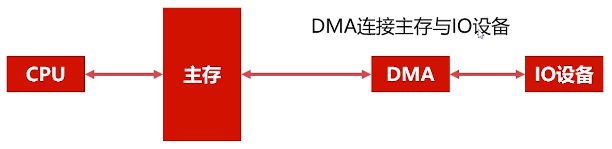

## 计算机存储器概览

### 存储器的分类

**按存储介质分类**

半导体存储器：内存、U盘、固态硬盘。

磁存储器：磁带、磁盘。

**按存取方式分类**

随机存储器(`RAM`)：随机读取、与位置无关。

串行存储器：与位置有关、按顺序查找。

只读存储器(`ROM`)：只读不写。

### 存储器的层次结构

缓存：`CPU`寄存器以及高速缓存。

主存：内存。

辅存：磁盘、`U`盘、移动硬盘。

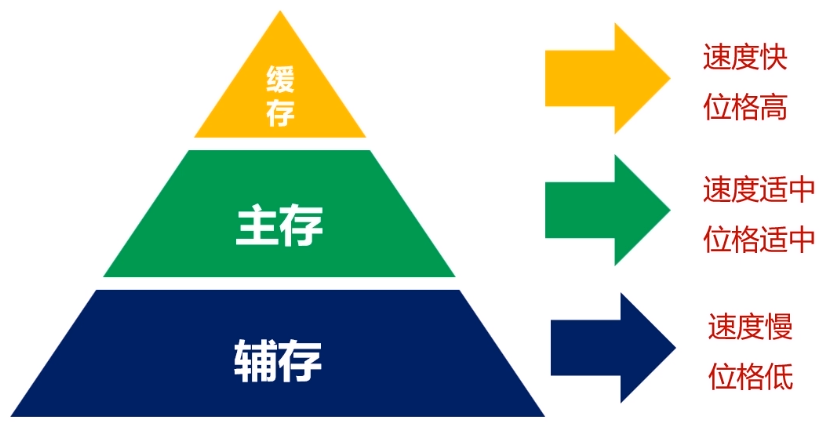

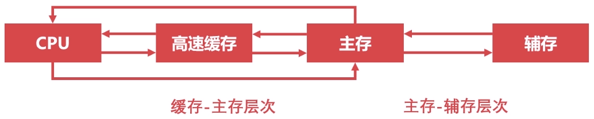

#### 缓存-主存层次

原理：局部性原理。

实现：在`CPU`与主存之间增加一层速度快(容量小)的`Cache`(高速缓存)。

目的：解决主存速度不足的问题。

局部性原理是指`CPU`访问存储器时，无论是**存取指令**还是**存取数据**，所访问的存储单元都**趋于聚集在一个较小的连续区域中**。

#### 主存-辅存层次

原理：局部性原理。

实现：主存之外增加辅助存储器(磁盘、`SD`卡、`U`盘等)。

目的：解决主存容量不足的问题。

## 计算机的主存储器与辅助存储器

计算机断电，内存数据丢失，但磁盘数据不会丢失。

### 主存储器——内存

- `RAM`(随机存取存储器)：`Random Access Memory`。
- `RAM`通过**电容**存储数据，必须隔一段时间刷新一次。
- 如果断电，那么一段时间后将丢失所有数据。

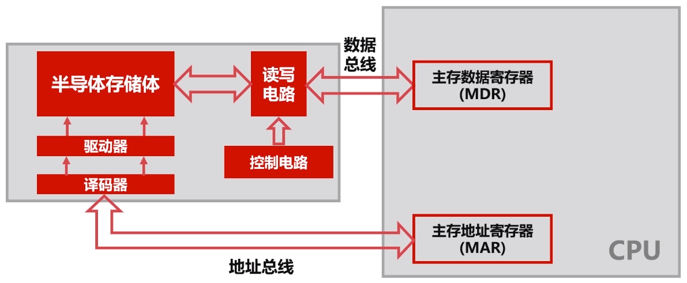

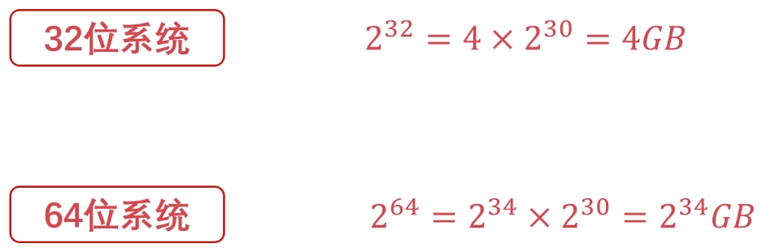

### 辅助存储器——磁盘

磁盘表面是可磁化的硬磁特性材料，移动磁头径向运动读取磁道信息。

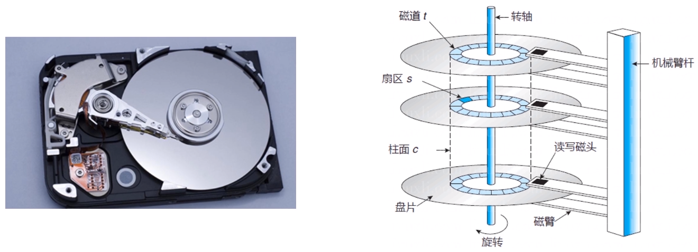

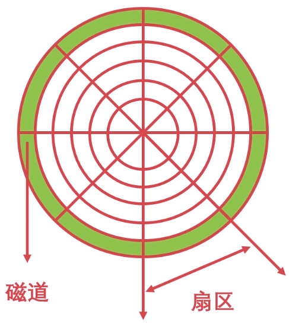

#### 磁盘调度算法

现磁头在磁道`4`，磁头方向向外，欲读取磁道`1 -> 4 -> 2 -> 3 -> 1 -> 5`。

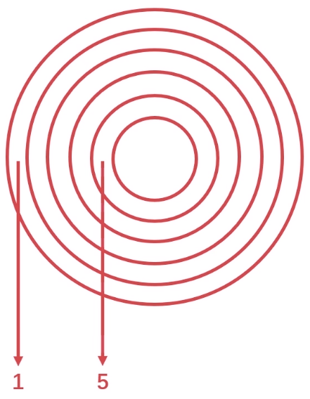

**先来先服务算法**

按顺序访问进程的磁道读写需求，`1 -> 4 -> 2 -> 3 -> 1 -> 5`。

**最短寻道时间优先算法**

与磁头当前位置有关，优先访问离磁头最近的磁道，`4 -> 5 -> 3 -> 2 -> 1 -> 1`。

**扫描算法(电梯算法)**

磁头每次只往一个方向移动，到达一个方向需要服务的尽头再反方向移动，`4 -> 3 -> 2 -> 1 -> 1 -> 5`。

**循环扫描算法**

磁头只能往一个方向移动，假设向里移动，`4 -> 5 -> 1 -> 1 -> 2 -> 3`。

## 计算机的高速缓存

### 高速缓存的工作原理

缓存与主存：存储的逻辑结构类似；缓存的容量较小；缓存的速度更快。

- `CPU`需要的数据在缓存里。
- `CPU`需要的数据不在缓存里。
- 不在缓存的数据需要去主存拿。

缓存命中率是衡量缓存的重要性能指标，访问高速缓存的次数占总次数的比例。

理论上`CPU`每次都能从高速缓存存取数据的时候，命中率为`1`。

### 高速缓存的替换策略

高速缓存的替换时机：当缓存没有待访问数据时，需要从主存载入所需要的数据。

**随机算法**

随机选择高速缓存中的数据进行替换。

**先进先出算法(FIFO)**

把高速缓存看作是一个先进先出的队列，优先替换最先进入队列的字块。

**最不经常使用算法(LFU)**

优先淘汰最不经常使用的字块，需要额外的空间记录字块的使用频率。

**最近最少使用算法(LRU)**

优先淘汰一段时间内没有被使用的字块；有多种实现方法，一般使用双向链表。

把当前访问节点置于链表最前面(保证链表头部节点是最近使用的)，替换掉末尾节点。

## 计算机的指令系统

### 机器指令的形式


操作码指明指令所要完成的操作，操作码的位数反映了机器的操作种类。

地址码直接给出操作数或者操作数的地址，分三地址指令、二地址指令和一地址指令。


```
(addr1) OP (addr2) -> (addr3)
```


```
(addr1) OP (addr2) -> (addr1) OR (addr2)
```


```
(addr1) OP -> (addr1)
```

零地址指令：在机器指令中无地址码。空操作、停机操作、中断返回操作等。

### 机器指令的操作类型

**数据传输**

- 寄存器之间、寄存器与存储单元、存储单元之间传送。
- 数据读写、交换地址数据、清零置一等操作。

**算数逻辑操作**

- 操作数之间的加减乘除运算。
- 操作数的与或非等逻辑位运算。

**移位操作**

- 数据左移(`×2`)、数据右移(`÷2`)。
- 完成数据在算数逻辑单元的必要操作。

**控制指令**

- 等待指令、停机指令、空操作指令、中断指令等。

### 机器指令的寻址方式

**指令寻址**

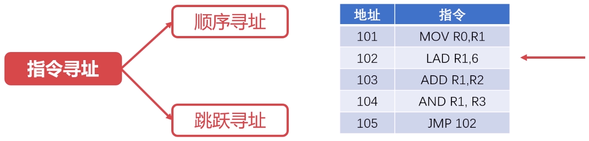