# 计算机组成原理之计算篇

## 进制运算的基础

### 进制概述

- 进制是一种计数方式，亦称进位计数法或位值计数法。
- 有限种数字符号来表示无限的数量。
- 使用的数字符号的数目称为这种进位制的基数或底数。

### 二进制运算的基础

**按权展开法**

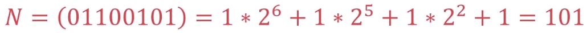

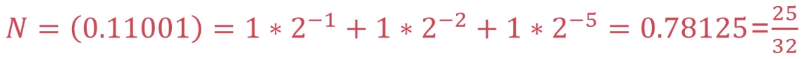

**重复相除法**

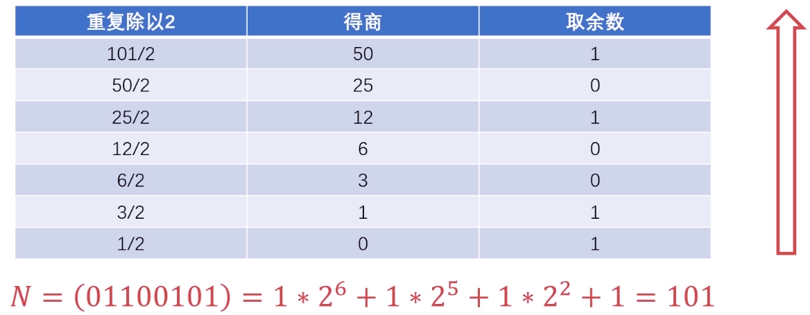

**重复相乘法**

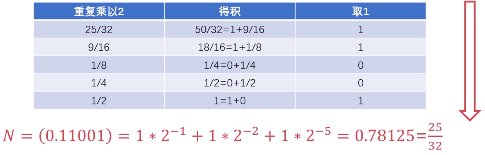

## 有符号数和无符号数

首位`0`表示正数，`1`表示负数。

### 原码表示法

- 使用`0`表示正数，`1`表示负数。
- 规定符号位位于数值第一位。
- 表达简单明了，是人类最容易理解的表示法。

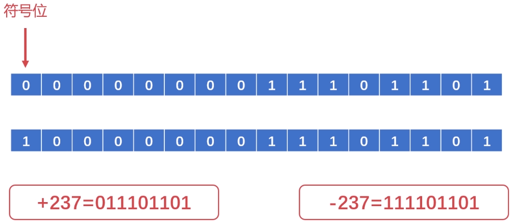

- `0`有两种表示方法：`00`和`10`。
- 原码进行运算非常复杂，特别是两个操作数符号不同的时候。

## 二进制的补码表示法

使用原码进行运算时，操作过程非常复杂。

补码：正整数的补码与其原码相同；求负整数的补码是在原码的基础上，除符号位外的所有位取反(`0`变`1`，`1`变`0`，符号位为`1`不变)后加`1`。

- 减法运算复杂，希望找到使用正数替代负数的方法。
- 使用加法代替减法操作，从而消除减法。

## 二进制的反码表示法

反码：正数的反码与其原码相同；负数的反码是在原码的基础上，除符号位外，逐位取反。

## 小数的二进制补码表示法

小数的补码同样适用上述规律。

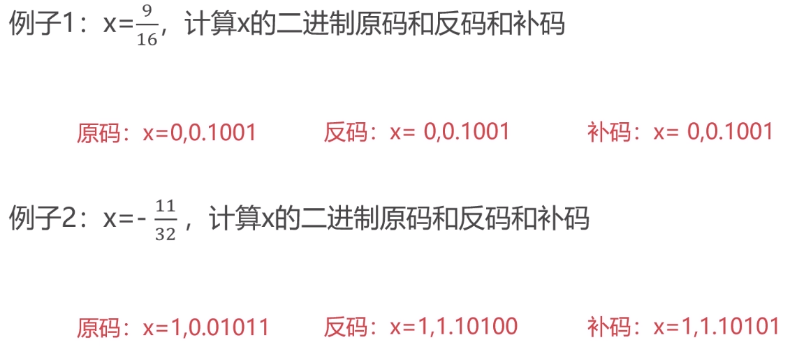

## 定点数和浮点数

### 定点数的表示方法

小数点固定在某个位置的数称之为定点数。

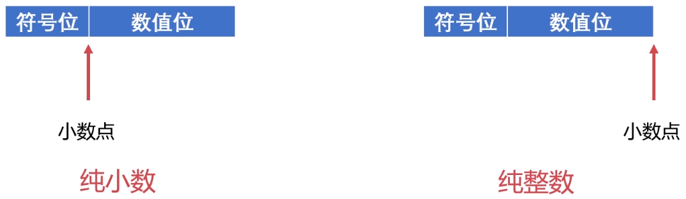

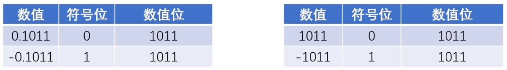

### 浮点数的表示方法

- 计算机处理的很大程度上不是纯小数或纯整数。
- 数据范围很大，定点数难以表达。

#### 浮点数的表示格式

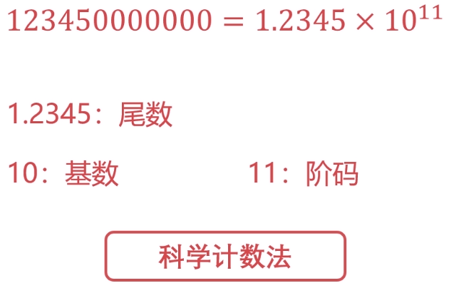

#### 浮点数的表示范围

- 单精度浮点数：使用`4`字节、`32`位来表达浮点数(`float`)。
- 双精度浮点数：使用`8`字节、`64`位来表达浮点数(`double`)。

#### 浮点数的规格化

- 尾数规定使用纯小数。
- 尾数最高位必须是`1`。

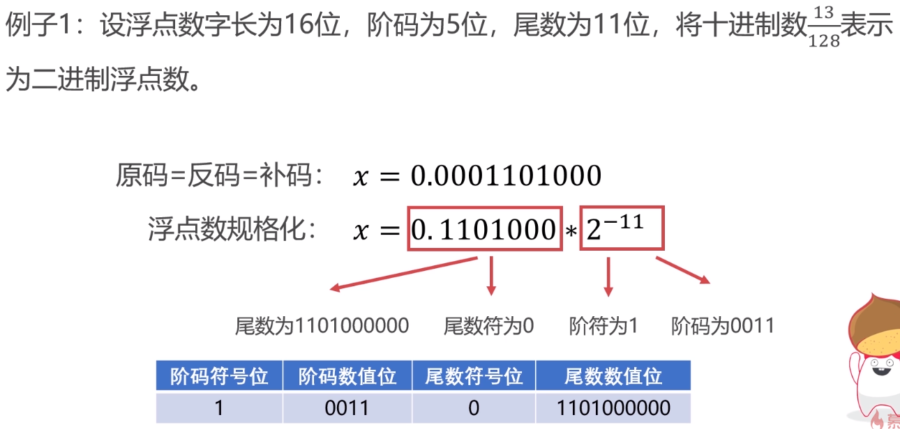

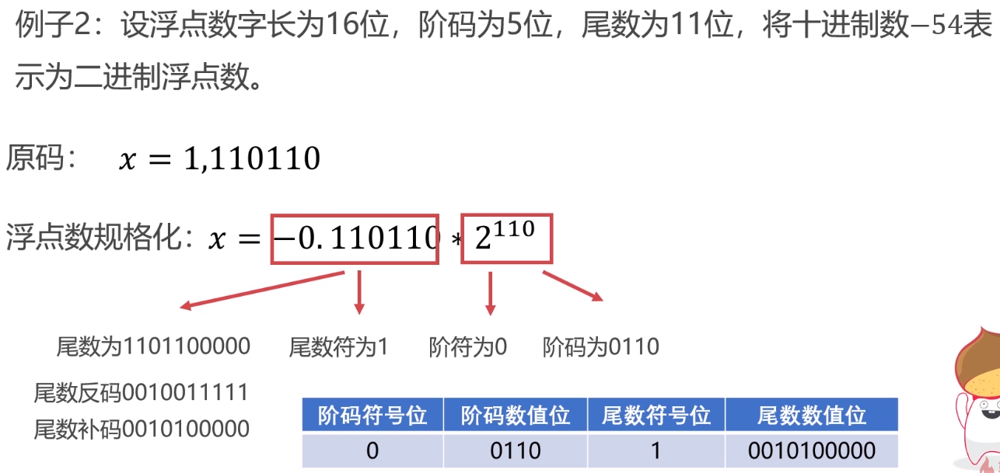

### 定点数与浮点数的对比

- 当定点数与浮点数位数相同时，浮点数表示的范围更大。
- 当浮点数尾数为规格化数时，浮点数的精度更高。
- 浮点数运算包含阶码和尾数，浮点数的运算更为复杂。

浮点数在数的表示范围、精度、溢出处理、编程等方面均优于定点数。

浮点数在数的运算规则、运算速度、硬件成本方面不如定点数。

## 定点数的加减法运算

数值位与符号位一同运算，并将符号位产生的进位自然丢掉。

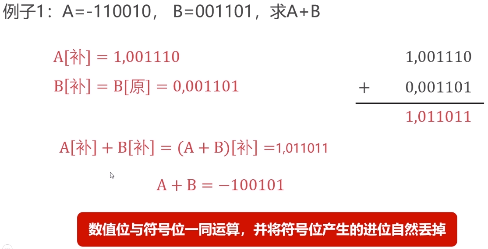

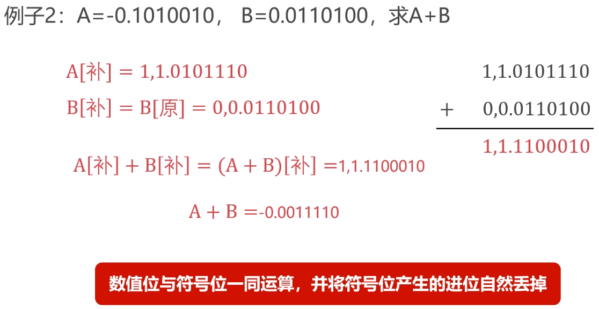

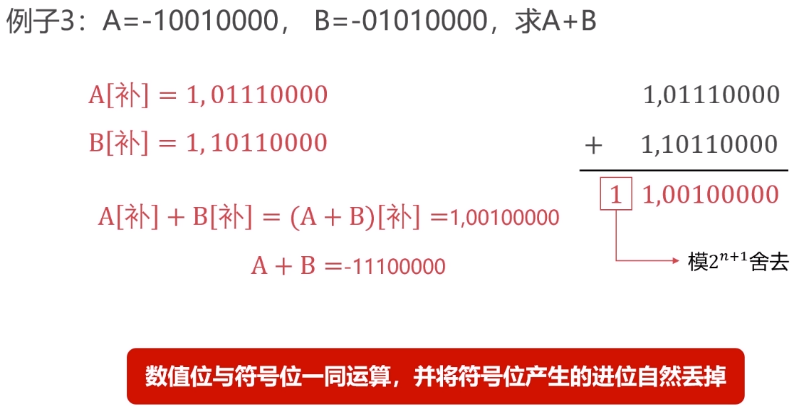

### 判断溢出

#### 双符号位判断法

- 单符号位表示变成双符号位：`0 => 00, 1 => 11`。
- 双符号位产生的进位丢弃。
- 结果的双符号位不同则表示溢出。

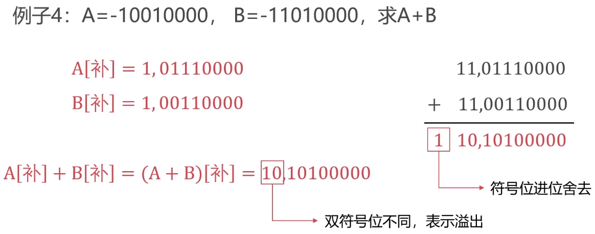

## 浮点数的加减法运算

### 对阶

对阶的目的是使得两个浮点数阶码一致，使得尾数可以进行运算。

- 浮点数尾数运算简单。
- 浮点数位数实际小数位与阶码有关。
- 阶码按小阶看齐大阶的原则。

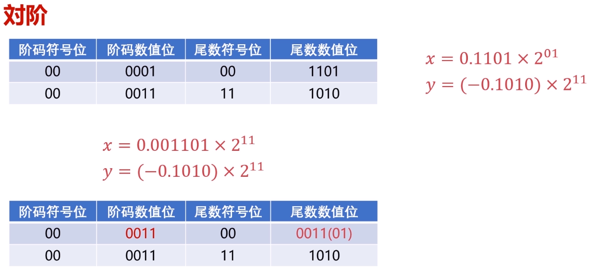

### 尾数求和

- 使用补码进行运算。
- 减法运算转化为加法运算：`A - B = A + (-B)`。

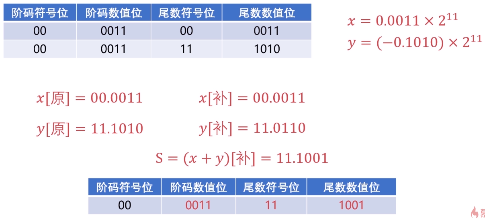

### 尾数规格化

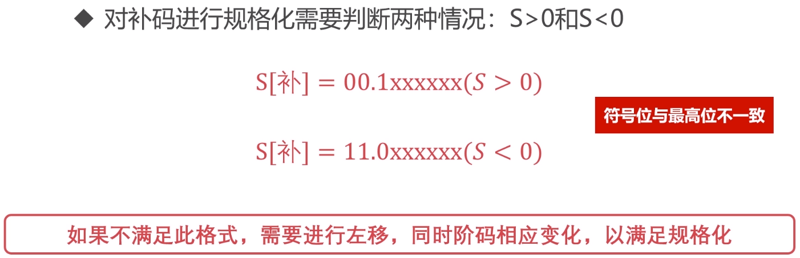

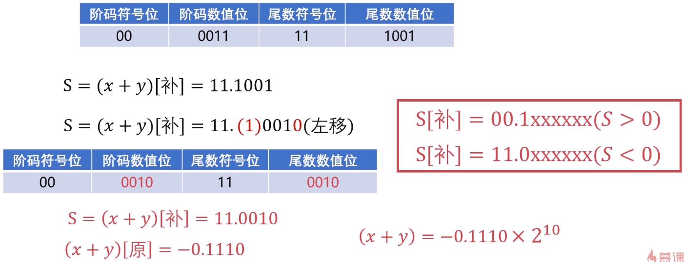

### 尾数规格化(右移)

- 一般情况下都是左移。
- 双符号位不一致下需要右移动(定点运算溢出情况)。
- 右移的话则需要进行舍入操作。

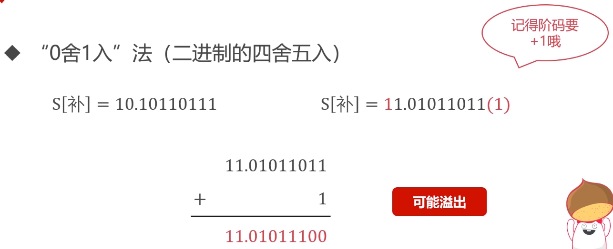

### 溢出判断

- 定点运算双符号位不一致为溢出。
- 浮点运算尾数双符号位不一致不算溢出，尾数双符号位可以进行右规。
- 浮点运算主要通过阶码的双符号位判断是否溢出。
- 如果规格化后，阶码双符号位不一致，则认为是溢出。

