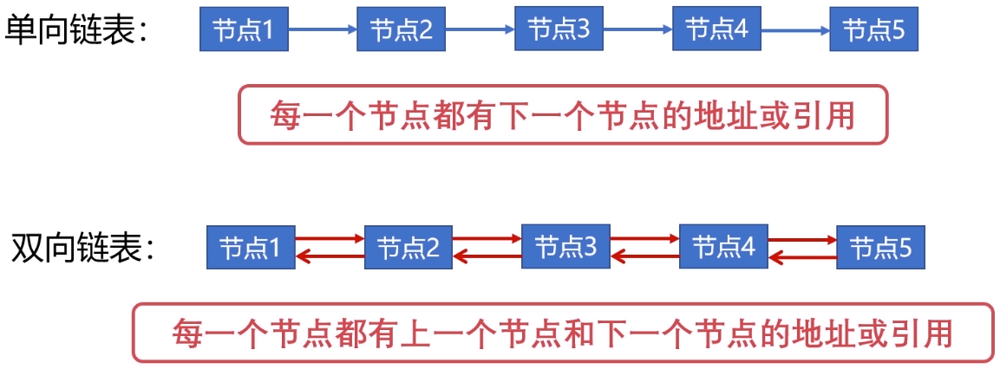

# 计算机组成原理实践

## 双向链表的原理与实践



```python
class Node:
    def __init__(self, key, value):
        self.key = key
        self.value = value
        self.prev = None
        self.next = None

    def __str__(self):
        val = '{%d: %d}' % (self.key, self.value)
        return val

    def __repr__(self):
        val = '{%d: %d}' % (self.key, self.value)
        return val


class DoubleLinkedList:
    def __init__(self, capacity=0xffff):
        self.capacity = capacity
        self.head = None
        self.tail = None
        self.size = 0

    def __add_head(self, node):
        if not self.head:
            self.head = node
            self.tail = node
            self.head.prev = None
            self.head.next = None
        else:
            node.next = self.head
            self.head.prev = node
            self.head = node
            self.head.prev = None
        self.size += 1
        return node

    def __add_tail(self, node):
        if not self.tail:
            self.tail = node
            self.head = node
            self.tail.prev = None
            self.tail.next = None
        else:
            self.tail.next = node
            node.prev = self.tail
            self.tail = node
            self.tail.next = None
        self.size += 1
        return node

    def __del_tail(self):
        if not self.tail:
            return
        node = self.tail
        if node.prev:
            self.tail = node.prev
            self.tail.next = None
        else:
            self.head = self.tail = None
        self.size -= 1
        return node

    def __del_head(self):
        if not self.head:
            return
        node = self.head
        if node.next:
            self.head = node.next
            self.head.prev = None
        else:
            self.head = self.tail = None
        self.size -= 1
        return node

    def __remove(self, node):
        if not node:
            node = self.tail
        if node == self.tail:
            self.__del_tail()
        elif node == self.head:
            self.__del_head()
        else:
            node.prev.next = node.next
            node.next.prev = node.prev
            self.size -= 1
        return node

    def pop(self):
        return self.__del_head()

    def append(self, node):
        return self.__add_tail(node)

    def append_front(self, node):
        return self.__add_head(node)

    def remove(self, node=None):
        return self.__remove(node)

    def print(self):
        p = self.head
        line = ''
        while p:
            line += '%s' % p
            p = p.next
            if p:
                line += '=>'
        print(line)
```

## 实现FIFO缓存置换算法

```python
from principle.DoubleLinkedList import DoubleLinkedList, Node


class FIFOCache(object):
    def __init__(self, capacity):
        self.capacity = capacity
        self.size = 0
        self.map = {}
        self.list = DoubleLinkedList(self.capacity)

    def get(self, key):
        if key not in self.map:
            return -1
        else:
            node = self.map.get(key)
            return node.value

    def put(self, key, value):
        if self.capacity == 0:
            return
        if key in self.map:
            node = self.map.get(key)
            self.list.remove(node)
            node.value = value
            self.list.append(node)
        else:
            if self.size == self.capacity:
                node = self.list.pop()
                del self.map[node.key]
                self.size -= 1
            node = Node(key, value)
            self.list.append(node)
            self.map[key] = node
            self.size += 1

    def print(self):
        self.list.print()
```

## 实现LRU缓存置换算法

```python
from principle.DoubleLinkedList import DoubleLinkedList, Node


class LRUCache(object):
    def __init__(self, capacity):
        self.capacity = capacity
        self.map = {}
        self.list = DoubleLinkedList(self.capacity)

    def get(self, key):
        if key in self.map:
            node = self.map[key]
            self.list.remove(node)
            self.list.append_front(node)
            return node.value
        else:
            return -1

    def put(self, key, value):
        if key in self.map:
            node = self.map.get(key)
            self.list.remove(node)
            node.value = value
            self.list.append_front(node)
        else:
            node = Node(key, value)
            if self.list.size >= self.list.capacity:
                old_node = self.list.remove()
                self.map.pop(old_node.key)

            self.list.append_front(node)
            self.map[key] = node

    def print(self):
        self.list.print()
```

## 实现LFU缓存置换算法

```python
from principle.DoubleLinkedList import DoubleLinkedList, Node


class LFUNode(Node):
    def __init__(self, key, value):
        self.freq = 0
        super(LFUNode, self).__init__(key, value)


class LFUCache(object):
    def __init__(self, capacity):
        self.capacity = capacity
        self.map = {}
        # key: 频率, value: 频率对应的双向链表
        self.freq_map = {}
        self.size = 0

    def __update_freq(self, node):
        freq = node.freq
        node = self.freq_map[freq].remove(node)
        if self.freq_map[freq].size == 0:
            del self.freq_map[freq]
        freq += 1
        node.freq = freq
        if freq not in self.freq_map:
            self.freq_map[freq] = DoubleLinkedList()
        self.freq_map[freq].append(node)

    def get(self, key):
        if key not in self.map:
            return -1
        node = self.map.get(key)
        self.__update_freq(node)
        return node.value

    def put(self, key, value):
        if self.capacity == 0:
            return
        if key in self.map:
            node = self.map.get(key)
            node.value = value
            self.__update_freq(node)
        else:
            if self.capacity == self.size:
                min_freq = min(self.freq_map)
                node = self.freq_map[min_freq].pop()
                del self.map[node.key]
                self.size -= 1
            node = LFUNode(key, value)
            node.freq = 1
            self.map[key] = node
            if node.freq not in self.freq_map:
                self.freq_map[node.freq] = DoubleLinkedList()
            node = self.freq_map[node.freq].append(node)
            self.size += 1

    def print(self):
        print('***************************')
        for k, v in self.freq_map.items():
            print('Freq = %d' % k)
            self.freq_map[k].print()
        print('***************************')
        print()
```