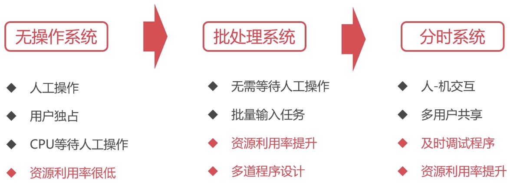
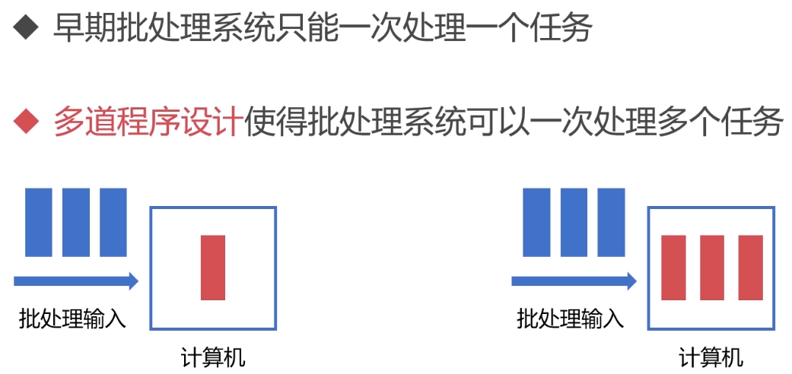
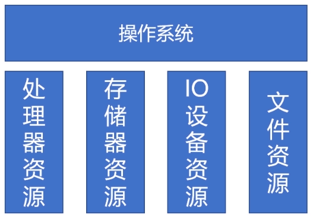
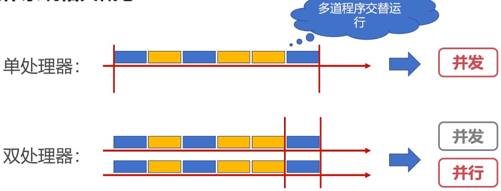
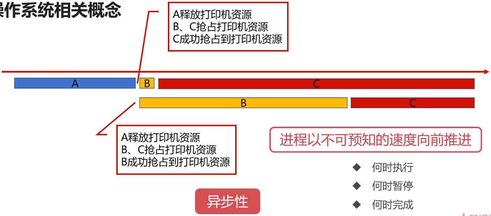
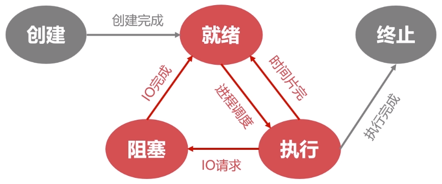
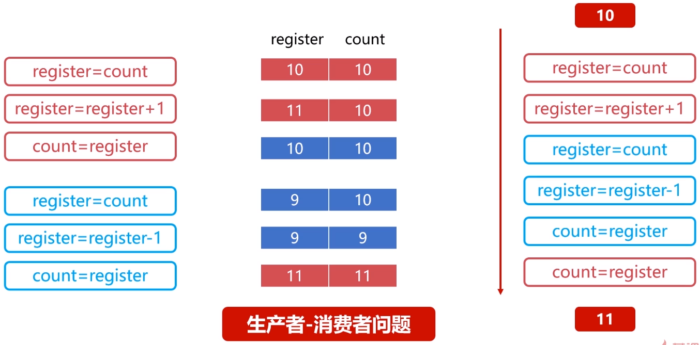
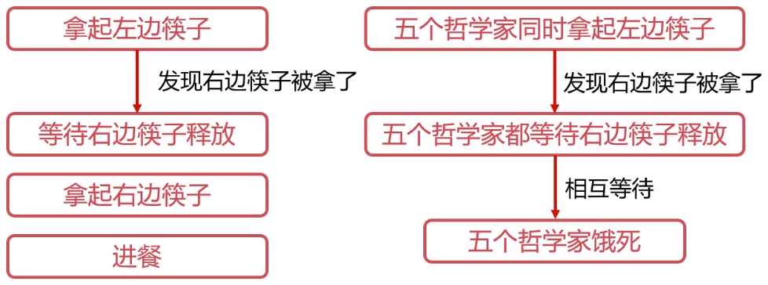

# 操作系统之基础篇

## 引言

对多道程序的管理是操作系统的重要功能。

- 多道程序设计是指在计算机内存中同时存放多个程序。
- 多道程序在计算机的管理程序之下相互穿插运行。

五大功能：进程管理、文件管理、存储管理、设备管理、作业管理。

## 操作系统概览

### What & Why

操作系统是管理硬件、提供用户交互的软件系统。

- 操作系统是管理计算机硬件和软件资源的**计算机程序**。
- 管理配置内存、决定资源供需顺序、控制输入输出设备等。
- 操作系统提供让用户和系统交互的**操作界面**。

### 操作系统的基本功能

#### 操作系统统一管理着计算机资源

#### 操作系统实现了对计算机资源的抽象

- 用户无需面向硬件接口编程。
- `IO`设备管理软件，提供读写接口。
- 文件管理软件，提供操作文件接口。

#### 操作系统提供了用户与计算机之间的接口

- 图像窗口形式。
- 命令形式。
- 系统调用形式。

### 操作系统相关概念

#### 并发性

- 并行是指两个或多个事件可以在**同一个时刻**发生。
- 并发是指两个或多个事件可以在**同一个时间间隔**发生。

#### 共享性

- 共享性表现为操作系统中的资源可供多个并发的程序共同使用。
- 这种共同使用的形式称之为资源共享。

互斥共享：当资源被程序`A`占用时，其他想使用的话只能等待，只有当进程`A`使用完之后，其他进程才可以使用该资源。

同时访问：某种资源在一段时间内**并发地**被多个程序访问，这种“同时”是宏观的，从宏观去看该资源可以被同时访问。

#### 虚拟性

- 虚拟性表现为把一个**物理实体**转变为若干个**逻辑实体**。
- 物理实体是真实存在的，逻辑实体是虚拟的。

**时分复用**

资源在时间上进行复用，不同程序**并发**使用，多道程序分时使用计算机的硬件资源，提高资源的利用率。

虚拟处理器技术：借助多道程序设计技术，为每个程序建立进程，多个程序分时复用处理器。

虚拟设备技术：物理设备虚拟为多个逻辑设备，每个程序占用一个逻辑设备，多个程序通过逻辑设备并发访问。

**空分复用**

用来实现虚拟磁盘、虚拟内存等，提高资源的利用率，提升编程效率。

虚拟磁盘技术：物理磁盘虚拟为逻辑磁盘，如`C/D/E`等逻辑盘，使用起来更加安全、方便。

虚拟内存技术：在逻辑上扩大程序的存储容量，使用比内存更大的容量，大大提升编程效率。

#### 异步性

- 在多道程序环境下，允许多个进程并发执行。
- 进程在资源使用时可能需要等待或放弃。
- 进程的执行并不是一气呵成的，而是以走走停停的形式推进。

## 进程管理之进程实体

### 为什么需要进程

在没有配置`OS`之前，资源属于当前运行的程序；配置`OS`之后，引入多道程序设计的概念；进程合理的隔离资源、运行环境，提升资源利用率。

- 进程是系统进行资源分配和调度的基本单位。
- 进程作为程序独立运行的载体保障程序正常执行。
- 进程的存在使得操作系统资源的利用率大幅提升。

### 进程的实体

#### 主存中的进程形态

标识符：唯一标记一个进程，用于区别其他进程。

状态：标记进程的进程状态，如：运行态。

程序计数器：进程即将被执行的下一条指令的地址。

内存指针：程序代码、进程数据相关指针。

上下文数据：进程执行时处理器存储的数据。

IO文件信息：被进程`IO`操作所占用的文件列表。

记账信息：使用`CPU`时间、时钟数总和等。

**进程控制块(PCB)**

- 用于描述和控制进程运行的通用数据结构。
- 记录进程当前状态和控制进程运行的全部信息。
- `PCB`使得进程是能够独立运行的基本单位。
- `PCB`是操作系统进行调度经常会被读取的信息。
- `PCB`是常驻内存的，存放在系统专门开辟的`PCB`区域内。

#### 进程与线程

一个进程可以有一个或多个线程。

- 线程是操作系统进行运行调度的最小单位。
- 包含在进程之中，是进程中实际运行工作的单位。
- 一个进程可以并发多个线程，每个线程执行不同的任务。

\ | 进程 | 线程
- | - | -
资源 | 资源分配的基本单位 | 不拥有资源
调度 | 独立调度的基本单位 | 独立调度的最小单位
系统开销 | 进程系统开销大 | 线程系统开销小
通信 | 进程IPC | 读写统一进程数据通信

## 进程管理之五状态模型

### 就绪状态

- 当进程被分配到除`CPU`以外所有必要的资源后。
- 只要再获得`CPU`的使用权，就可以立即运行。
- 其他资源都准备好，只差`CPU`资源的状态为就绪状态。

就绪队列：在一个系统中多个处于就绪状态的进程通常排成一个队列。

### 执行状态

- 进程获得`CPU`，其程序正在执行称为执行状态。
- 在单处理机中，在某个时刻只能有一个进程是处于执行状态。

### 阻塞状态

- 进程因某种原因如：其他设备未就绪而无法继续执行。
- 从而放弃`CPU`的状态称为阻塞状态。

阻塞队列：处于阻塞状态的进程排成一个队列。

### 创建状态

分配`PCB` -> 插入就绪队列

- 创建进程时拥有`PCB`但其他资源尚未就绪的状态称为创建状态。
- 操作系统提供`fork`函数接口创建进程。

### 终止状态

系统清理 -> `PCB`归还

- 进程结束由系统清理或者归还`PCB`的状态称为终止状态。

## 进程管理之进程同步

### 为什么需要进程间同步

#### 生产者消费者问题

有一群生产者进程在生产产品，并将这些产品提供给消费者进程进行消费，生产者进程和消费者
进程可以并发执行，在两者之间设置了一个具有`n`可缓冲区的缓冲池，生产者进程需要将所生产
的产品放到一个缓冲区中，消费者进程可以从缓冲区取走产品消费。

缓冲区是在`Cache`上的，操作缓存需要以下步骤：

1. register = count
2. register = register + 1
3. count = register

#### 哲学家进餐问题

有五个哲学家，他们的生活方式是交替地进行思考和进餐，哲学家们共同使用一张圆桌，分别坐
在周围的五张椅子上，在圆桌上有五个碗和五支筷子。平时哲学家们只进行思考，饥饿时则试图
取靠近他们的左、右两支筷子，只有两支筷子都被他拿到的时候就能进餐，进餐完毕之后，放下
左右筷子继续思考。

1. 拿起左边筷子
2. 拿起右边筷子
3. 进餐

#### 需要进程间的同步

- 对竞争资源在多进程间进行使用次序的协调。
- 使得并发执行的多个进程之间可以有效使用资源和相互合作。

### 进程间同步的原则

临界资源指的是一些虽作为共享资源却又无法同时被多个线程共同访问的共享资源。当有进程在使用临界资源时，其他进程必须依据操作系统的同步机制等待占用进程释放该共享资源才可重新竞争使用共享资源。

- 空闲让进：资源无占用，允许使用。
- 忙则等待：资源有占用，请求进程等待。
- 有限等待：保证有限等待时间能够使用资源。
- 让权等待：等待时，进程需要让出`CPU`。

**进程同步方法**

- 消息队列
- 共享存储
- 信号量

### 线程同步

当多线程并发时，进程内多线程也需要同步。

**线程同步方法**

- 互斥量
- 读写锁
- 自旋锁
- 条件变量