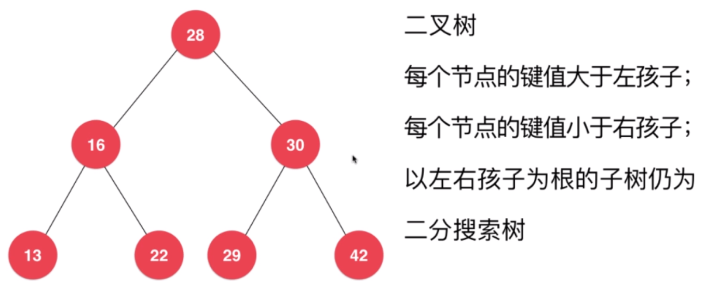

# 二分搜索树

## 二分查找法

对于有序数列，才能使用二分查找法。

```cpp
/**
 * 如果找到 target 返回索引 index
 * 如果找不到 返回 -1
 */
template<typename T>
int binarySearch(T* arr, int n, T target) {
    /** 在 arr[l, r] 范围内查找 target */
    int l = 0, r = n - 1;
    while (l <= r) {
        int mid = l + (r - l) / 2;
        if (arr[mid] == target) {
            return mid;
        }
        if (target < arr[mid]) {
            r = mid - 1;
        } else {
            l = mid + 1;
        }
    }
    return -1;
}
```

## 二分搜索树

不仅可高效查找数据，还可以高效地插入、删除数据。

- 二叉树
- 每个节点的键值大于左孩子
- 每个节点的键值小于右孩子
- 以左右孩子为根的子树仍为二分搜索树
- 不一定是完全二叉树



```cpp
template<typename Key, typename Value>
class BST {
private:
    struct Node {
        Key key;
        Value value;
        Node* left;
        Node* right;

        Node(Key key, Value value) {
            this->key = key;
            this->value = value;
            this->left = this->right = NULL;
        }

        Node(Node* node) {
            this->key = node->key;
            this->value = node->value;
            this->left = node->left;
            this->right = node->right;
        }
    };

    Node* root;
    int count;

    /**
     * 向以 node 为根的二叉搜索树中，插入节点 (key, value)
     * 返回插入新节点后的二叉搜索树的根
     */
    Node* insert(Node *node, Key key, Value value) {
        if (node == NULL) {
            this->count ++;
            return new Node(key, value);
        }
        if (key == node->key) {
            node->value = value;
        } else if (key < node->key) {
            node->left = insert(node->left, key, value);
        } else {
            node->right = insert(node->right, key, value);
        }
        return node;
    }

    /**
     * 以 node 为根的二叉搜索树中是否包含键值为 key 的节点
     */
    bool contain(Node* node, Key key) {
        if (node == NULL) {
            return false;
        }
        if (key == node->key) {
            return true;
        } else if (key < node->key) {
            return contain(node->left, key);
        } else {
            return contain(node->right, key);
        }
    }

    /**
     * 以 node 为根的二叉搜索树中查找 key 对应的 value
     */
    Value* search(Node* node, Key key) {
        if (node == NULL) {
            return NULL;
        }
        if (key == node->key) {
            return &(node->value);
        } else if (key < node->key) {
            return search(node->left, key);
        } else {
            return search(node->right, key);
        }
    }

    /**
     * 对以 node 为根的二叉搜索树进行前序遍历
     */
    void preOrder(Node* node) {
        if (node != NULL) {
            cout << node->key << endl;
            preOrder(node->left);
            preOrder(node->right);
        }
    }

    /**
     * 对以 node 为根的二叉搜索树进行中序遍历
     */
    void inOrder(Node* node) {
        if (node != NULL) {
            inOrder(node->left);
            cout << node->key << endl;
            inOrder(node->right);
        }
    }

    /**
     * 对以 node 为根的二叉搜索树进行后序遍历
     */
    void postOrder(Node* node) {
        if (node != NULL) {
            postOrder(node->left);
            postOrder(node->right);
            cout << node->key << endl;
        }
    }

    /**
     * 对以 node 为根的二叉搜索树 返回最小键值的节点
     */
    Node* min(Node* node) {
        if (node->left == NULL) {
            return node;
        }
        return min(node->left);
    }

    /**
     * 对以 node 为根的二叉搜索树 返回最大键值的节点
     */
    Node* max(Node* node) {
        if (node->right == NULL) {
            return node;
        }
        return max(node->right);
    }

    /**
     * 删除掉以 node 为根的二叉搜索树中的最小节点
     * 返回删除节点后新的二分搜索树的根
     */
    Node* removeMin(Node* node) {
        if (node->left == NULL) {
            Node* right = node->right;
            delete node;
            this->count --;
            return right;
        }

        node->left = removeMin(node->left);
        return node;
    }

    /**
     * 删除掉以 node 为根的二叉搜索树中的最大节点
     * 返回删除节点后新的二分搜索树的根
     */
    Node* removeMax(Node* node) {
        if (node->right == NULL) {
            Node* left = node->left;
            delete node;
            this->count --;
            return left;
        }

        node->right = removeMax(node->right);
        return node;
    }

    /**
     * 删除掉以 node 为根的二叉搜索树中键值为 key 的节点
     * 返回删除节点后新的二分搜索树的根
     */
    Node* remove(Node* node, Key key) {
        if (node == NULL) {
            return NULL;
        }
        if (key < node->key) {
            node->left = remove(node->left, key);
        } else if (key > node->key) {
            node->right = remove(node->right, key);
        } else {
            if (node->left == NULL) {
                Node* right = node->right;
                delete node;
                this->count --;
                return right;
            }

            if (node->right == NULL) {
                Node* left = node->left;
                delete node;
                this->count --;
                return left;
            }

            /** 使用 node 的右子树的最小节点代替该节点 */
            Node* successor = new Node(min(node->right));
            this->count ++;

            successor->right = removeMin(node->right);
            successor->left = node->left;

            delete node;
            this->count --;
            return successor;
        }
    }

    void destroy(Node* node) {
        if (node != NULL) {
            destroy(node->left);
            destroy(node->right);

            delete node;
            this->count --;
        }
    }
public:
    BST() {
        this->root = NULL;
        this->count = 0;
    }

    ~BST() {
        destroy(this->root);
    }

    int size() {
        return this->count;
    }

    bool isEmpty() {
        return this->count == 0;
    }

    void insert(Key key, Value value) {
        this->root = insert(this->root, key, value);
    }

    bool contain(Key key) {
        return contain(this->root, key);
    }

    Value* search(Key key) {
        return search(this->root, key);
    }

    void preOrder() {
        preOrder(this->root);
    }

    void inOrder() {
        inOrder(this->root);
    }

    void postOrder() {
        postOrder(this->root);
    }

    /**
     * 二分搜索树层序遍历
     */
    void levelOrder() {
        queue<Node*> q;
        q.push(root);

        while (!q.empty()) {
            Node *node = q.front();
            q.pop();

            cout << node->key << endl;

            if (node->left) {
                q.push(node->left);
            }
            if (node->right) {
                q.push(node->right);
            }
        }
    }

    void removeMin() {
        if (this->root) {
            this->root = removeMin(this->root);
        }
    }

    void removeMax() {
        if (this->root) {
            this->root = removeMax(this->root);
        }
    }

    void remove(Key key) {
        this->root = remove(this->root, key);
    }
};
```