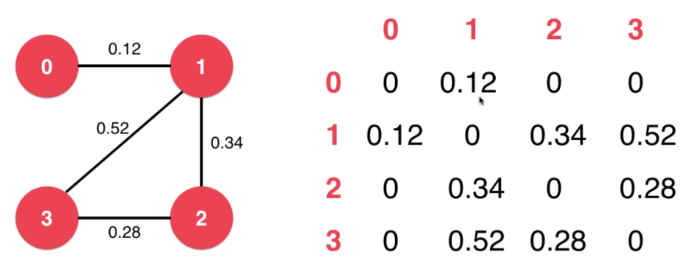
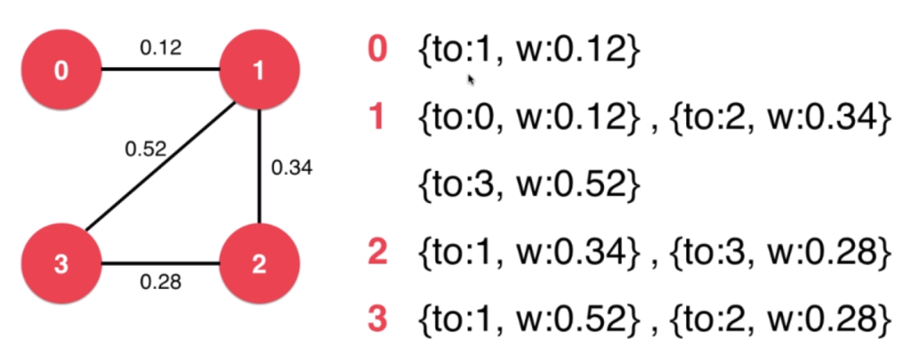
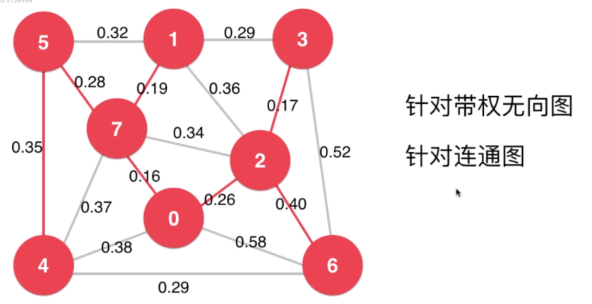

# 最小生成树

## 有权图

使用邻接矩阵存储有权图：



使用邻接表存储有权图：



```cpp
template<typename Weight>
class Edge {
private:
    int v, w;
    Weight weight;

public:
    Edge(int v, int w, Weight weight) {
        this->v = v;
        this->w = w;
        this->weight = weight;
    }

    int V() {
        return this->v;
    }

    int W() {
        return this->w;
    }

    Weight wt() {
        return this->weight;
    }

    /** 给定一个顶点, 返回另一个顶点 */
    int other(int x){
        assert( x == v || x == w );
        return x == v ? w : v;
    }

    bool operator<(Edge<Weight>& e) {
        return this->weight < e.wt();
    }

    bool operator<=(Edge<Weight>& e) {
        return this->weight <= e.wt();
    }

    bool operator>(Edge<Weight>& e) {
        return this->weight > e.wt();
    }

    bool operator>=(Edge<Weight>& e) {
        return this->weight >= e.wt();
    }

    bool operator==(Edge<Weight>& e) {
        return this->weight == e.wt();
    }
};

/**
 * 稠密图 邻接矩阵
 */
template<typename Weight>
class DenseGraph {
private:
    /** n 点数 m 边数 */
    int n, m;
    /** 是否是有向图 */
    bool directed;
    /** 邻接矩阵 */
    vector<vector<Edge<Weight>*>> g;

public:
    DenseGraph(int n, bool directed) {
        this->n = n;
        this->m = 0;
        this->directed = directed;
        for (int i = 0; i < n; i ++) {
            this->g.push_back(vector<Edge<Weight>*>(n, NULL));
        }
    }

    ~DenseGraph() {
        for (int i = 0; i < n; i ++) {
            for (int j = 0; j < n; j ++) {
                if (g[i][j] != NULL) {
                    delete g[i][j];
                }
            }
        }
    }

    int V() {
        return n;
    }

    int E() {
        return m;
    }

    void addEdge(int v, int w, Weight weight) {
        assert(v >= 0 && v < n);
        assert(w >= 0 && w < n);

        if (hasEdge(v, w)) {
            delete g[v][w];
            if (!directed) {
                delete g[w][v];
            }
            m --;
        }

        g[v][w] = new Edge<Weight>(v, w, weight);
        if (!directed) {
            g[w][v] = new Edge<Weight>(w, v, weight);
        }
        m ++;
    }

    bool hasEdge(int v, int w) {
        assert(v >= 0 && v < n);
        assert(w >= 0 && w < n);
        return g[v][w] != NULL;
    }

    class adjIterator {
    private:
        DenseGraph& G;
        int v;
        int index;
    public:
        adjIterator(DenseGraph& graph, int v): G(graph) {
            this->v = v;
            this->index = 0;
        }

        Edge<Weight>* begin() {
            int begin = -1;
            return next();
        }

        Edge<Weight>* next() {
            for (index += 1; index < G.V(); index ++) {
                if (G.g[v][index]) {
                    return G.g[v][index];
                }
            }
            return NULL;
        }

        bool end() {
            return index >= G.V();
        }
    };
};

/**
 * 稀疏图 邻接表
 */
template<typename Weight>
class SparseGraph {
private:
    /** n 点数 m 边数 */
    int n, m;
    /** 是否是有向图 */
    bool directed;
    /** 邻接表 */
    vector<vector<Edge<Weight>*>> g;

public:
    SparseGraph(int n, bool directed) {
        this->n = n;
        this->m = 0;
        this->directed = directed;
        for (int i = 0; i < n; i ++) {
            this->g.push_back(vector<Edge<Weight>*>());
        }
    }

    int V() {
        return n;
    }

    int E() {
        return m;
    }

    void addEdge(int v, int w, Weight weight) {
        assert(v >= 0 && v < n);
        assert(w >= 0 && w < n);

        g[v].push_back(new Edge<Weight>(v, w, weight));
        if (v != w && !directed) {
            g[w].push_back(new Edge<Weight>(w, v, weight));
        }
        m ++;
    }

    bool hasEdge(int v, int w) {
        assert(v >= 0 && v < n);
        assert(w >= 0 && w < n);

        for (int i : g[v]) {
            if (g[v][i]->other(v) == w) {
                return true;
            }
        }
        return false;
    }

    class adjIterator {
    private:
        SparseGraph& G;
        int v;
        int index;
    public:
        adjIterator(SparseGraph& graph, int v): G(graph) {
            this->v = v;
            this->index = 0;
        }

        Edge<Weight>* begin() {
            index = 0;
            if (!G.g[v].empty()) {
                return G.g[v][index];
            }
            return NULL;
        }

        Edge<Weight>* next() {
            index ++;
            if (index < G.g[v].size()) {
                return G.g[v][index];
            }
            return NULL;
        }

        bool end() {
            return index >= G.g[v].size();
        }
    };
};
```

## 最小生成树

找`V-1`条边，连接`V`个顶点，使得总权值最小，生成最小生成树。



**切分定理**

切分：把图中的节点分为两部分。

横切边：如果一个边的两个端点，属于切分不同的两部分，这个边称为横切边。

切分定理：给定任意切分，横切边中权值最小的边必然属于最小生成树。

## Lazy Prim

```cpp
template<typename Graph, typename Weight>
class LazyPrimMST {
private:
    Graph& G;
    MinHeap<Edge<Weight>> heap;
    bool* marked;
    vector<Edge<Weight>> mst;
    Weight mstWeight;

    void visit(int v) {
        assert(!marked[v]);
        marked[v] = true;

        typename Graph::adjIterator adj(G, v);
        for (Edge<Weight>* e = adj.begin(); !adj.end(); e = adj.next()) {
            if (!marked[e->other(v)]) {
                heap.insert(*e);
            }
        }
    }

public:
    LazyPrimMST(Graph& graph): G(graph), heap(MinHeap<Edge<Weight>>(graph.E())) {
        this->marked = new bool[G.V()];
        for (int i = 0; i < G.V(); i ++) {
            this->marked[i] = false;
        }
        mst.clear();

        visit(0);
        while (!heap.isEmpty()) {
            Edge<Weight> e = heap.extractMin();
            if (marked[e.V()] == marked[e.W()]) {
                continue;
            }

            mst.push_back(e);
            if (!marked[e.V()]) {
                visit(e.V());
            } else {
                visit(e.W());
            }
        }

        mstWeight = mst[0].wt();
        for (int i = 1; i < mst.size(); i ++) {
            mstWeight += mst[i].wt();
        }
    }

    ~LazyPrimMST() {
        delete[] marked;
    }

    vector<Edge<Weight>> mstEdges() {
        return mst;
    }

    Weight result() {
        return mstWeight;
    }
};
```

## Prime

```cpp
template<typename Graph, typename Weight>
class PrimMST {
private:
    Graph& G;
    IndexMinHeap<Weight> iheap;
    vector<Edge<Weight>*> edgeTo;
    bool* marked;
    vector<Edge<Weight>> mst;
    Weight mstWeight;

    void visit(int v) {
        assert(!marked[v]);
        marked[v] = true;

        typename Graph::adjIterator adj(G, v);
        for (Edge<Weight>* e = adj.begin(); !adj.end(); e = adj.next()) {
            int w = e->other(v);
            if (!marked[w]) {
                if (edgeTo[w]) {
                    iheap.insert(w, e->wt());
                    edgeTo[w] = e;
                } else if (e->wt() < edgeTo[w]) {
                    edgeTo[w] = e;
                    iheap.change(w, e->wt());
                }
            }
        }
    }

public:
    PrimMST(Graph& graph): G(graph), iheap(IndexMinHeap<Weight>(graph.V())) {
        this->marked = new bool[G.V()];
        for (int i = 0; i < G.V(); i ++) {
            this->marked[i] = false;
            edgeTo.push_back(NULL);
        }
        mst.clear();

        visit(0);
        while (!iheap.isEmpty()) {
            int v = iheap.extractMinIndex();
            assert(edgeTo[v]);
            mst.push_back(*edgeTo[v]);
            visit(v);
        }

        mstWeight = mst[0].wt();
        for (int i = 1; i < mst.size(); i ++) {
            mstWeight += mst[i].wt();
        }
    }

    ~PrimMST() {
        delete[] marked;
    }

    vector<Edge<Weight>> mstEdges() {
        return mst;
    }

    Weight result() {
        return mstWeight;
    }
};
```

## Kruskal

```cpp
template<typename Graph, typename Weight>
class KruskalMST {
private:
    vector<Edge<Weight>> mst;
    Weight mstWeight;

public:
    KruskalMST(Graph& graph) {
        MinHeap<Edge<Weight>> heap(graph.E());
        for (int i = 0; i < graph.V(); i ++) {
            typename Graph::adjIterator adj(G, v);
            for (Edge<Weight>* e = adj.begin(); !adj.end(); e = adj.next()) {
                if (e->V() < e->W()) {
                    heap.insert(*e);
                }
            }
        }

        /** 使用并查集判断是否连通，避免成环 */
        UnionFind uf(graph.V());
        while (!heap.isEmpty() && mst.size() < graph.V() - 1) {
            Edge<Weight> e = heap.extractMin();
            if (uf.isConnected(e.V(), e.W())) {
                continue;
            }
            mst.push_back(e);
            uf.unionElements(e.V(), e.W());
        }

        mstWeight = mst[0].wt();
        for (int i = 1; i < mst.size(); i ++) {
            mstWeight += mst[i].wt();
        }
    }

    ~KruskalMST() {
    }

    vector<Edge<Weight>> mstEdges() {
        return mst;
    }

    Weight result() {
        return mstWeight;
    }
};
```