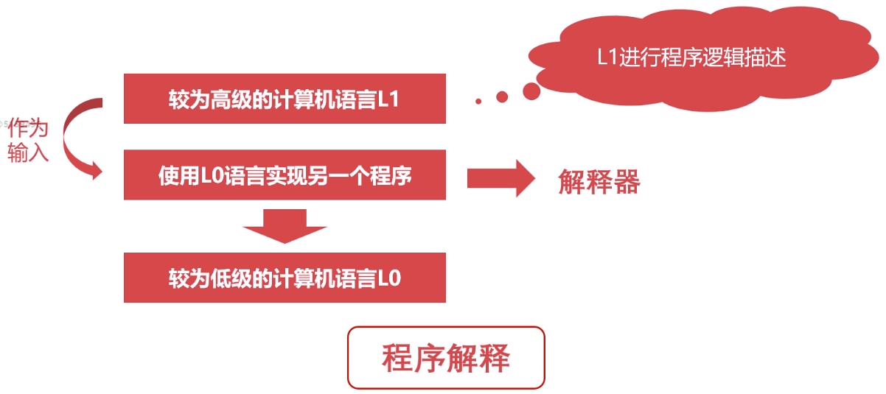

# 计算机组成原理之概述篇

## 计算机的层次与编程语言

### 程序翻译

代表语言：`C/C++`、`Object-C`、`Golang`。

### 程序解释

代表语言：`Python`、`PHP`、`JavaScript`。

### 翻译 + 解释

代表语言：`Java`、`C#`。

### 计算机的层级

| 层级 | 特点 |
| ---- | ---- |
| 硬件逻辑层 | 门、触发器等逻辑电路组成 |
| 微程序机器层 | 微指令集，微指令所组成的微程序直接交由硬件执行 |
| 传统机器层 | `CPU`指令集(机器指令)，与硬件直接相关，不同架构的`CPU`使用不同的`CPU`指令集 |
| 操作系统层 | 向上提供简易操作界面，向下对接指令系统，管理硬件资源，是软件和硬件之间的适配层 |
| 汇编语言层 | 汇编语言，汇编器将其翻译成可直接执行的机器语言 |
| 高级语言层 | 广大程序员所接受的高级语言 |
| 应用层 | 各种应用软件 |

## 计算机的速度单位

### 容量单位

计算机只认识`0/1`两种状态，在物理层面，使用高低电平记录信息。

- `0/1`称为`bit`(比特位)
- `1 Byte = 8 bit`
- `1 KB = 1024 Byte`
- `1 MB = 1024 KB`
- `1 GB = 1024 MB`
- `1 TB = 1024 GB`
- `1 PB = 1024 TB`
- `1 EB = 1024 PB`

**习题**

`1G`内存，可以存储多少字节的数据？可以存储多少比特数据？

> 

为什么网上买的移动硬盘`500G`，其实只有`465G`？

> 硬盘厂商使用`10`进制标记容量，进制为`1000`，而不是`1024`，所以容量小。
> 

### 速度单位

**网络速度**

为什么电信拉的`100M`光纤，测试峰值速度只有`12M`每秒？

> 网络常用单位为`Mbps`，`100 Mbps = 100 Mbit/s = 12.5MB/s`。

**CPU频率**

`CPU`的速度一般体现为`CPU`的时钟频率，`CPU`的时钟频率的单位一般是赫兹`(Hz)`。

## 计算机的字符与编码集

### 字符编码集的历史

**ASCII码**

使用`7`个`bits`就可以完全表示`ASCII`码，共计`2^7 = 128`个字符，很多应用或者国家中的符号都无法表示。

**Extended ASCII码**

第一次对`ASCII`码进行扩充，`7bits => 8bits`，共计`256`个字符。

### 编码集

**GB 2312**

`1980`年发明，是我国最早最完备的编码集，共收录了`7445`个字符，但不符合国际标准。

**GBK**

`1995`年推出，向下兼容`GB 2312`，向上支持国际`ISO`标准，收录了`21003`个汉字，支持全部中日韩字符。

**Unicode**

兼容全球的字符集，`Unicode`定义了世界通用的符号集，`UTF-*`实现了该编码，`UTF-8`以字节为单位对`Unicode`进行编码。

> `Windows`系统默认使用`GBK`编码。