## 进程管理之进程实体

### 为什么需要进程

在没有配置`OS`之前，资源属于当前运行的程序；配置`OS`之后，引入多道程序设计的概念；进程合理的隔离资源、运行环境，提升资源利用率。

- 进程是系统进行资源分配和调度的基本单位。
- 进程作为程序独立运行的载体保障程序正常执行。
- 进程的存在使得操作系统资源的利用率大幅提升。

### 进程的实体

#### 主存中的进程形态

标识符：唯一标记一个进程，用于区别其他进程。

状态：标记进程的进程状态，如：运行态。

程序计数器：进程即将被执行的下一条指令的地址。

内存指针：程序代码、进程数据相关指针。

上下文数据：进程执行时处理器存储的数据。

IO文件信息：被进程`IO`操作所占用的文件列表。

记账信息：使用`CPU`时间、时钟数总和等。

**进程控制块(PCB)**

- 用于描述和控制进程运行的通用数据结构。
- 记录进程当前状态和控制进程运行的全部信息。
- `PCB`使得进程是能够独立运行的基本单位。
- `PCB`是操作系统进行调度经常会被读取的信息。
- `PCB`是常驻内存的，存放在系统专门开辟的`PCB`区域内。

#### 进程与线程

一个进程可以有一个或多个线程。

- 线程是操作系统进行运行调度的最小单位。
- 包含在进程之中，是进程中实际运行工作的单位。
- 一个进程可以并发多个线程，每个线程执行不同的任务。

\ | 进程 | 线程
:-: | :-: | :-:
资源 | 资源分配的基本单位 | 不拥有资源
调度 | 独立调度的基本单位 | 独立调度的最小单位
系统开销 | 进程系统开销大 | 线程系统开销小
通信 | 进程IPC | 读写统一进程数据通信

## 进程管理之五状态模型

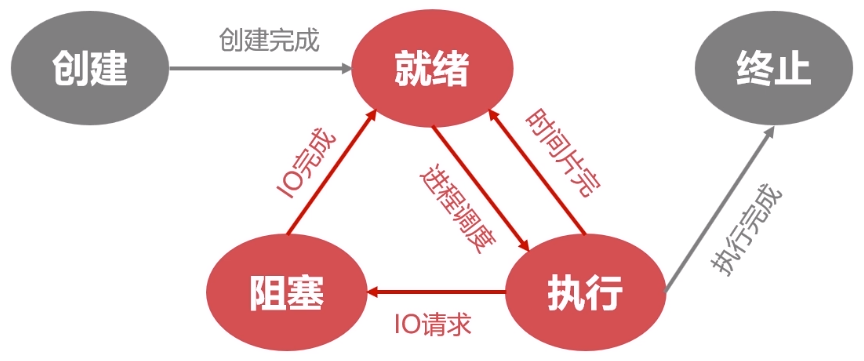

### 就绪状态

- 当进程被分配到除`CPU`以外所有必要的资源后。
- 只要再获得`CPU`的使用权，就可以立即运行。
- 其他资源都准备好，只差`CPU`资源的状态为就绪状态。

就绪队列：在一个系统中多个处于就绪状态的进程通常排成一个队列。

### 执行状态

- 进程获得`CPU`，其程序正在执行称为执行状态。
- 在单处理机中，在某个时刻只能有一个进程是处于执行状态。

### 阻塞状态

- 进程因某种原因如：其他设备未就绪而无法继续执行。
- 从而放弃`CPU`的状态称为阻塞状态。

阻塞队列：处于阻塞状态的进程排成一个队列。

### 创建状态

分配`PCB` -> 插入就绪队列

- 创建进程时拥有`PCB`但其他资源尚未就绪的状态称为创建状态。
- 操作系统提供`fork`函数接口创建进程。

### 终止状态

系统清理 -> `PCB`归还

- 进程结束由系统清理或者归还`PCB`的状态称为终止状态。

## 进程管理之进程同步

### 为什么需要进程间同步

#### 生产者消费者问题

有一群生产者进程在生产产品，并将这些产品提供给消费者进程进行消费，生产者进程和消费者
进程可以并发执行，在两者之间设置了一个具有`n`可缓冲区的缓冲池，生产者进程需要将所生产
的产品放到一个缓冲区中，消费者进程可以从缓冲区取走产品消费。

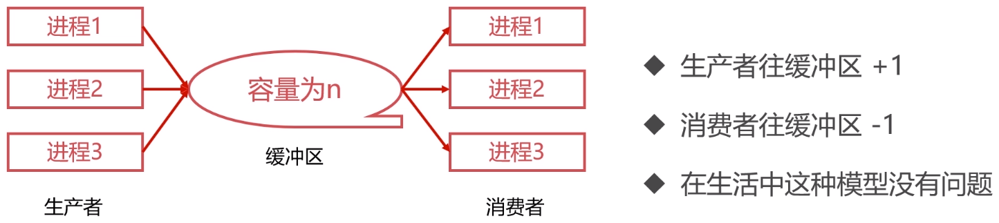

缓冲区是在`Cache`上的，操作缓存需要以下步骤：

1. register = count
2. register = register + 1
3. count = register

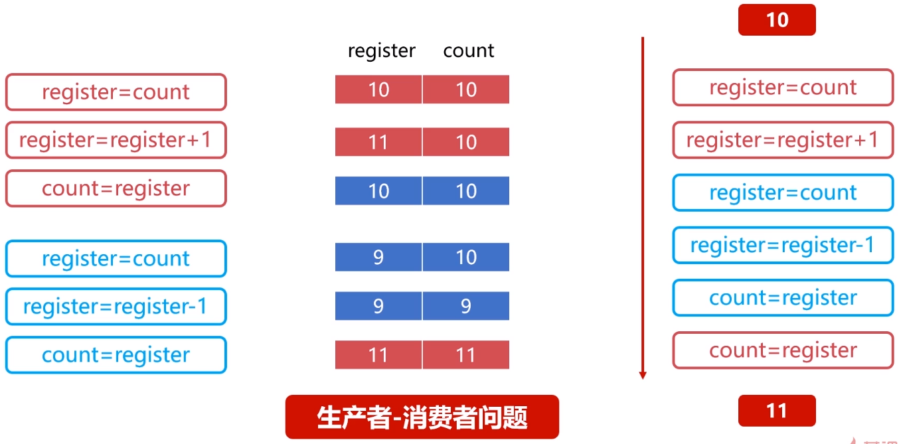

#### 哲学家进餐问题

有五个哲学家，他们的生活方式是交替地进行思考和进餐，哲学家们共同使用一张圆桌，分别坐
在周围的五张椅子上，在圆桌上有五个碗和五支筷子。平时哲学家们只进行思考，饥饿时则试图
取靠近他们的左、右两支筷子，只有两支筷子都被他拿到的时候就能进餐，进餐完毕之后，放下
左右筷子继续思考。

1. 拿起左边筷子
2. 拿起右边筷子
3. 进餐

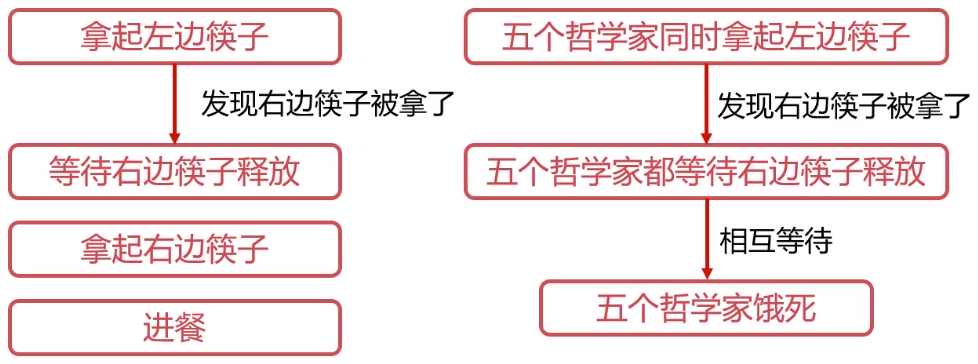

#### 需要进程间的同步

- 对竞争资源在多进程间进行使用次序的协调。
- 使得并发执行的多个进程之间可以有效使用资源和相互合作。

### 进程间同步的原则

临界资源指的是一些虽作为共享资源却又无法同时被多个线程共同访问的共享资源。当有进程在使用临界资源时，其他进程必须依据操作系统的同步机制等待占用进程释放该共享资源才可重新竞争使用共享资源。

- 空闲让进：资源无占用，允许使用。
- 忙则等待：资源有占用，请求进程等待。
- 有限等待：保证有限等待时间能够使用资源。
- 让权等待：等待时，进程需要让出`CPU`。

**进程同步方法**

- 消息队列
- 共享存储
- 信号量

### 线程同步

当多线程并发时，进程内多线程也需要同步。

**线程同步方法**

- 互斥量
- 读写锁
- 自旋锁
- 条件变量

## Linux的进程管理

### Linux进程的相关概念

#### 进程的类型

**前台进程**

- 前台进程就是具有终端，可以和用户交互的进程。

**后台进程**

- 与前台进程相对，没有占用终端的就是后台进程。
- 后台程序基本上不和用户交互，优先级比前台进程低。
- 将需要执行的命令以`&`符号结束即启动后台进程。

**守护进程**

- 守护进程是特殊的后台进程。
- 很多守护进程在系统引导的时候启动，一直运行直到系统关闭。
- 进程名称以`d`结尾的一般都是守护进程。

#### 进程的标记

**进程ID**

- 进程`ID`是进程的唯一标记，每个进程拥有不同的`ID`。
- 进程`ID`表现为一个非负整数，最大值由操作系统限定。

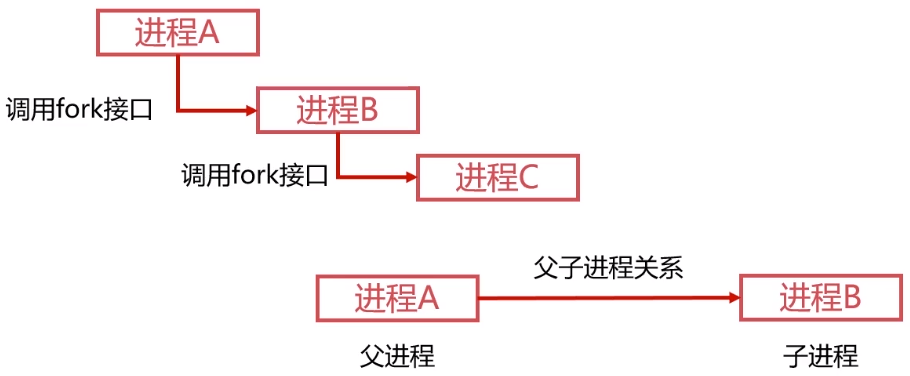

- `ID`为`0`的进程为`idle`进程，是系统创建的第一个进程。
- `ID`为`1`的进程为`init`进程，是`0`号进程的子进程，完成系统初始化。
- `init`进程是所有用户进程的祖先进程。

**进程的状态标记**

状态符号 | 状态说明
:-: | :-:
R | TASK_RUNNING，运行状态
S | TASK_INTERRUPTIBLE，睡眠状态
D | TASK_UNINTERRUPTIBLE，IO等待的睡眠状态
T | TASK_STOPPED，暂停状态
Z | TASK_DEAD/EXIT_ZOMBIE，退出状态/僵尸进程

### 操作Linux进程的相关命令

#### ps

- `ps`命令常用于显示当前进程的状态。
- `ps`命令常配合`aux`参数或`ef`参数和`grep`命令检索特定进程。

#### kill

- `kill`命令发送指定信号给进程。
- `kill -l`可以查看操作系统支持的信号。
- 只有`SIGKILL 9`信号可以无条件终止进程，其他信号进程有权忽略。

## 作业管理之进程调度

### 进程调度概述

进程调度是指计算机通过决策决定哪个就绪进程可以获得`CPU`使用权。

- 保留旧进程的运行信息，请出旧进程。
- 选择新进程，准备运行环境并分配`CPU`。

就绪队列的排队机制：将就绪进程按照一定的方式排成队列，以便调度程序可以最快找到就绪进程。

选择运行进程的委派机制：调度程序以一定的策略选择就绪进程，将`CPU`资源分配给它。

新老进程的上下文切换机制：保存当前进程的上下文信息，装入被委派执行进程的运行上下文。

#### 非抢占式的调度

- 处理器一旦分配给某个进程，就让该进程一直使用下去。
- 调度程序不以任何原因抢占正在被使用的处理器。
- 直到进程完成工作或因为`IO`阻塞才会让出处理器。

#### 抢占式的调度

- 允许调度程序以一定的策略暂停当前运行的进程。
- 保存好旧进程的上下文信息，分配处理器给新进程。

\ | 抢占式调度 | 非抢占式调度
:-: | :-: | :-:
系统开销 | 频繁切换，开销大 | 切换次数少，开销小
公平性 | 相对公平 | 不公平
应用 | 通用系统 | 专用系统

### 进程调度算法

#### 先来先服务调度算法

- 就绪队列按先来先服务方式排队，调度就绪队列队头进程。

#### 短进程优先调度算法

- 调度程序优先选择就绪队列中估计运行时间最短的进程。
- 不利于长作业进程的执行。

#### 高优先权优先调度算法

- 进程附带优先权，调度程序优先选择权重高的进程。
- 使得紧迫的任务可以优先处理。

#### 时间片轮转调度算法

- 按先来先服务的原则排列就绪进程。
- 每次从队列头部取出待执行进程，分配一个时间片执行。
- 是相对公平的调度算法，但不能保证及时响应用户。

## 作业管理之死锁

死锁是指两个或两个以上的进程在执行过程中，由于竞争资源或者由于彼此通信而造成的一种阻塞的现象，若无外力作用，它们都将无法推进下去。此时称系统处于死锁状态或系统产生了死锁，这些永远在互相等待的进程称为死锁进程。

### 死锁的产生

#### 竞争资源

- 共享资源数量不满足各个进程需求。
- 各个进程之间发生资源竞争导致死锁。

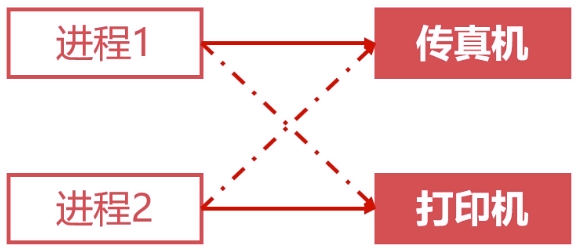

- 等待请求的资源被释放。
- 自身占用资源不释放。

#### 进程调度顺序不当

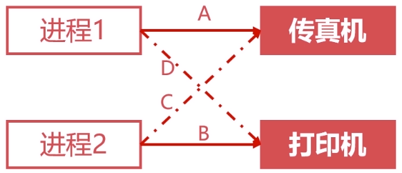

如果调度顺序为`A -> B -> C -> D`，产生死锁；调度顺序为`A -> D -> B -> C`，不会产生死锁。

#### 死锁的四个必要条件

**互斥条件**

- 进程对资源的使用是排他性的使用。
- 某资源只能由一个进程使用，其他进程需要使用只能等待。

**请求保持条件**

- 进程至少保持一个资源，又提出新的资源请求。
- 新资源被占用，请求被阻塞。
- 被阻塞的进程不释放自己保持的资源。

**不可剥夺条件**

- 进程获得的资源在未完成使用前不能被剥夺。
- 获得的资源只能由进程自身释放。

**环路等待条件**

- 发生死锁时，必然存在进程-资源环形链。

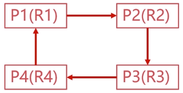

### 死锁的处理

#### 预防死锁的方法

破坏死锁的必要条件，即可预防死锁。

**破坏请求保持条件**

- 系统规定进程运行之前，一次性申请所有需要的资源。
- 进程在运行期间不会提出资源请求，从而破坏请求保持条件。

**破坏不可剥夺条件**

- 当一个进程请求新的资源得不到满足时，必须释放占有的资源。
- 进程运行时占有的资源可以被释放，意味着可以被剥夺。

**破坏环路等待条件**

- 可用资源线性排序，申请必须按照需要递增申请。
- 线性申请不再形成环路，从而破坏了环路等待条件。

#### 银行家算法

- 是一个可操作的著名的避免死锁的算法。
- 以银行借贷系统分配策略为基础的算法。

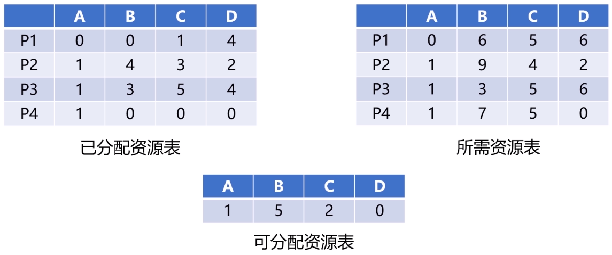

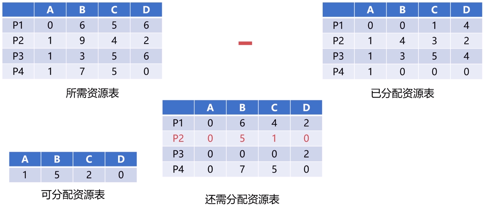

## 存储管理之内存分配与回收

### 内存分配的过程

#### 单一连续分配

- 单一连续分配是最简单的内存分配方式。
- 只能在单用户、单进程的操作系统中使用。

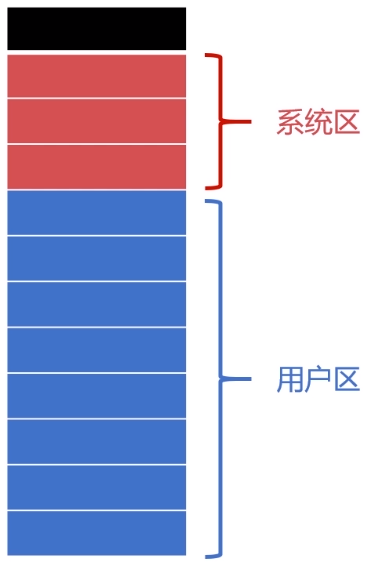

#### 固定分区分配

- 固定分区分配是支持多道程序的最简单存储分配方式。
- 内存空间被划分为若干固定大小的区域。
- 每个分区只提供给一个程序使用，互不干扰。

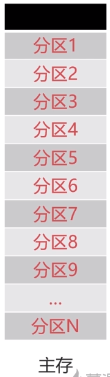

#### 动态分区分配

- 根据进程实际需要，动态分配内存空间。
- 相关数据结构、分配算法。

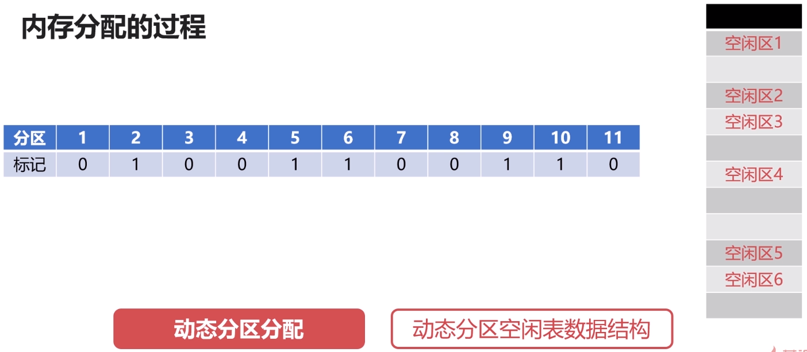

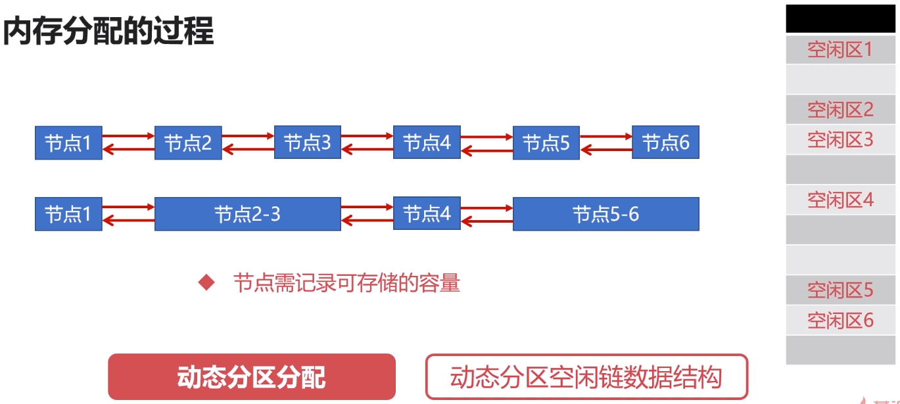

**首次适应算法(FF)**

- 分配内存时从开始顺序查找适合内存区。
- 若没有合适的空闲区，则该次分配失败。
- 每次从头部开始，使得头部地址空间不断被划分。

**最佳适应算法(BF)**

- 最佳适应算法要求空闲区链表按照容量大小排序。
- 遍历空闲区链表找到最佳合适空闲区。

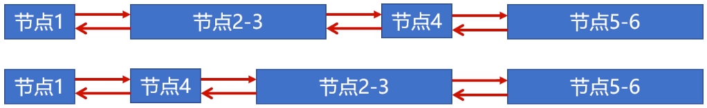

**快速适应算法(QF)**

- 快速适应算法要求有多个空闲区链表。
- 每个空闲区链表存储一种容量的空闲区。

### 内存回收的过程

- 不需要新建空闲链表节点。
- 只需要把空闲区`1`的容量增大为空闲区即可。

- 将回收区与空闲区合并。
- 新的空闲区使用回收区的地址。

- 将空闲区`1`、空闲区`2`和回收区合并。
- 新的空闲区使用空闲区`1`的地址。

- 为回收区创建新的空闲节点。
- 插入到相应的空闲区链表中去。

## 存储管理之段页式存储管理

### 页式存储管理

### 段式存储管理

### 段页式存储管理