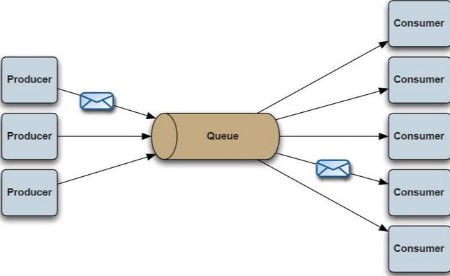
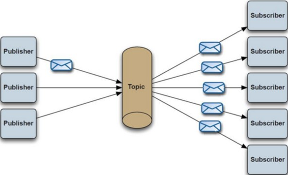
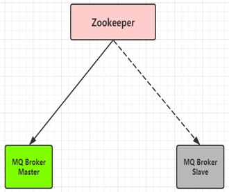
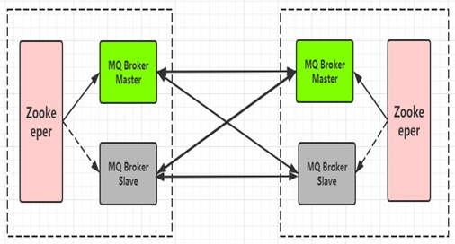

# ActiveMQ

## JMS

`JMS(Java Message Service)`：`Java`消息服务，定义了`Java`中访问消息中间件的接口规范。

目前知名的开源`MOM(Message Oriented Middleware)`消息中间件都“基本遵循”或“参考”`JMS`规范。

## 了解ActiveMQ

`ActiveMQ`是一个完全支持`JMS 1.1`和`J2EE 1.4`规范的`JMS Provider`实现，可以说那个年代`ActiveMQ`在业界应用最广泛，当然如果现在想要有更强大的性能和海量数据处理能力，`ActiveMQ`还需要不断的升级版本，不断的提升性能和架构设计的重构。

就算现在我们`80%`以上的业务我们使用`ActiveMQ`已经足够满足需求，其丰富的`API`、多种集群构建模式使得他成为业界老牌消息中间件，在中小型企业中应用广泛！

当然如果你想针对大规模、高并发应用服务做消息中间件技术选型，譬如淘宝、京东这种大型的电商网站，尤其是双`11`这种特殊时间，`ActiveMQ`可能就显得力不从心了。

## 消息投递模式

点对点：生产者向队列投递一条消息，只有一个消费者能够监听得到这条消息。

发布订阅：生产者向队列投递一条消息，所有监听该队列的消费者都能够监听得到这条消息。

## ActiveMQ各项指标

服务性能：`ActiveMQ`的性能一般，在早期传统行业为王的时代还是比较流行的，但现如今面对高并发、大数据的业务场景，往往力不从心。

数据存储：默认采用`kahadb`存储(索引文件形式存储)，也可以使用高性能的`google leveldb`(内存数据库存储)，或者可以使用`MySQL`、`Oracle`进程消息存储(关系型数据库存储)。

集群架构：`ActiveMQ`可以与`zookeeper`进行构建主备集群模型，并且多套的主备模型直接可以采用`Network`的方式构建分布式集群。

## ActiveMQ集群架构模式

### Master-Slave

`Master-Slave`：顾名思义，就是主从方式，当然这里要理解为主备的方式，也就是双机热备机制；`Master Slave`背后的想法是，消息被复制到`slave broker`，因此即使`master broker`遇到了像硬件故障之类的错误，你也可以立即切换到`slave broker`而不丢失任何消息。`Master Slave`是目前`ActiveMQ`推荐的高可靠性和容错的解决方案。

- 上图绿色的为主节点，灰色的则为备份节点，这两个节点都是运行状态的。

- `zookeeper`的作用就是为了当绿色的主节点宕机时，进行及时切换到备份的灰色节点上去，使其进行主从角色的互换，用于实现高可用性的方案。

- `Master-Slave`集群模型的缺点也显而易见，就是不能做到分布式的`topic`、`queue`，当消息量巨大时，我们的`MQ`集群压力过大，没办法满足分布式的需求。

### Network

`Network`：这里可以理解为网络通信方式，也可以说叫`Network of brokers`。这种方式真正解决了分布式消息存储和故障转移、`broker`切换的问题。可以理解消息会进行均衡；从`ActiveMQ 1.1`版本起，`ActiveMQ`支持`networks of brokers`。它支持分布式的`queues`和`topics`。

一个`broker`会相同对待所有的订阅(`subscription`)：不管他们是来自本地的客户连接，还是来自远程`broker`，它都会递送有关的消息拷贝到每个订阅。远程`broker`得到这个消息拷贝后，会依次把它递送到其内部的本地连接上。

- 首先，这种方案需要两套或多套`Master-Slave`的集群模型才可以搞定，部署非常麻烦，需要两套或多套集群直接相互交叉配置，相互间能够感知到彼此的存在。

- 其次，`Network`虽然解决了分布式消息队列这个难题，但是还有很多潜在的问题，最典型的就是资源浪费问题，并且也可能达不到所预期的效果；通常采用`Master-Slave`模型是传统型互联网公司的首选，作为互联网公司往往会选择开箱即用的消息中间件，从运维、部署、使用各个方面都要优于`ActiveMQ`，当然`ActiveMQ`毕竟是 “老牌传统强`Q`”，`Apache`的顶级项目之一，目前正在进行新版本的重构(对于`5.X`版本)与落地，下一代“`Artemis`代理”，也可以理解为“`6.X`”；有兴趣的小伙伴可以关注一下官网，传送门如下：[https://activemq.apache.org/](https://activemq.apache.org/)