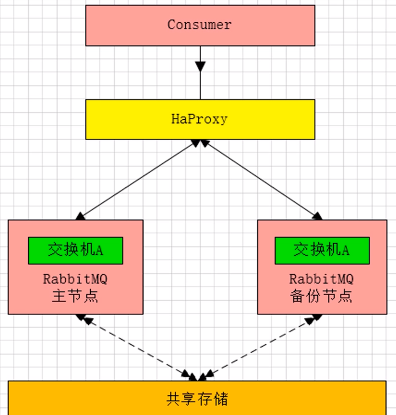

# RabbitMQ

## 主备模式

`warren`(兔子窝)，一个主/备方案，主节点如果挂了，从节点提供服务。

主节点故障，切换到备份节点，主节点恢复后，会成为备份节点的备份节点。

## 远程模式

远距离通信和复制，可以实现双活的一种模式，简称`Shovel`模式。

所谓`Shovel`就是我们可以把消息进行不同数据中心的复制工作，可以跨地域的让两个`MQ`集群互联。

## 镜像模式

集群模式非常经典的就是`Mirror`镜像模式，保证`100%`数据不丢失。

在实际工作中用的最多，并且实现集群非常的简单，一般互联网大厂都会构建这种镜像集群模式。

### Mirror镜像队列

## 多活模式