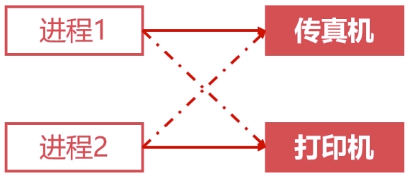
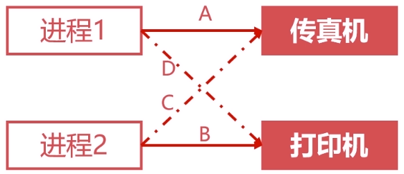
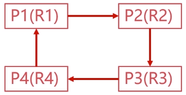
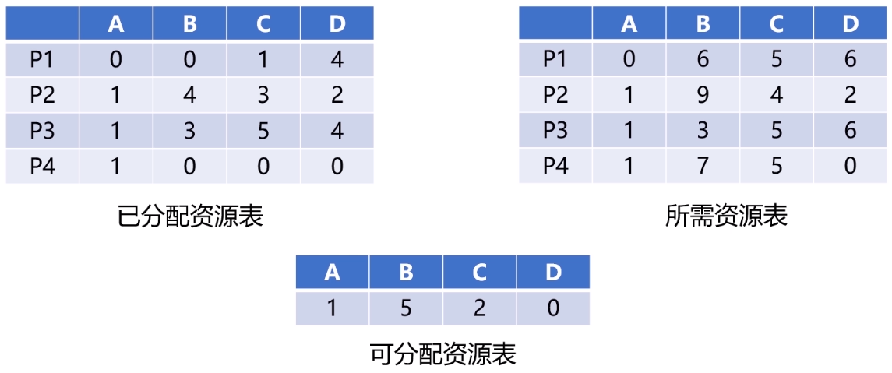
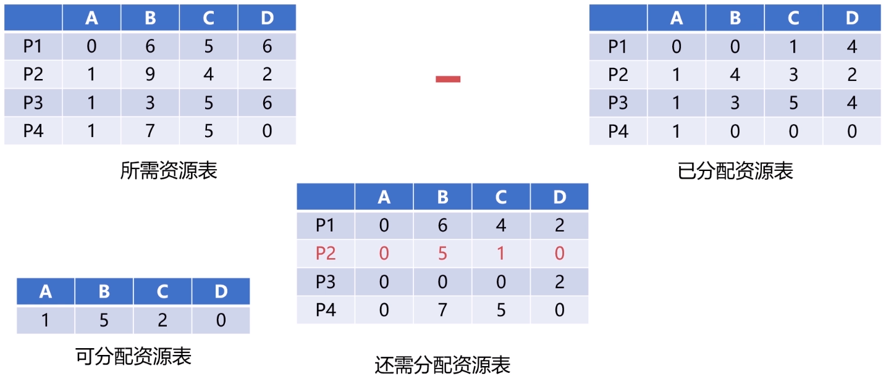

# 作业管理之死锁

死锁是指两个或两个以上的进程在执行过程中，由于竞争资源或者由于彼此通信而造成的一种阻塞的现象，若无外力作用，它们都将无法推进下去。此时称系统处于死锁状态或系统产生了死锁，这些永远在互相等待的进程称为死锁进程。

## 死锁的产生

### 竞争资源

- 共享资源数量不满足各个进程需求。
- 各个进程之间发生资源竞争导致死锁。

- 等待请求的资源被释放。
- 自身占用资源不释放。

### 进程调度顺序不当

如果调度顺序为`A -> B -> C -> D`，产生死锁；调度顺序为`A -> D -> B -> C`，不会产生死锁。

### 死锁的四个必要条件

**互斥条件**

- 进程对资源的使用是排他性的使用。
- 某资源只能由一个进程使用，其他进程需要使用只能等待。

**请求保持条件**

- 进程至少保持一个资源，又提出新的资源请求。
- 新资源被占用，请求被阻塞。
- 被阻塞的进程不释放自己保持的资源。

**不可剥夺条件**

- 进程获得的资源在未完成使用前不能被剥夺。
- 获得的资源只能由进程自身释放。

**环路等待条件**

- 发生死锁时，必然存在进程-资源环形链。

## 死锁的处理

### 预防死锁的方法

破坏死锁的必要条件，即可预防死锁。

**破坏请求保持条件**

- 系统规定进程运行之前，一次性申请所有需要的资源。
- 进程在运行期间不会提出资源请求，从而破坏请求保持条件。

**破坏不可剥夺条件**

- 当一个进程请求新的资源得不到满足时，必须释放占有的资源。
- 进程运行时占有的资源可以被释放，意味着可以被剥夺。

**破坏环路等待条件**

- 可用资源线性排序，申请必须按照需要递增申请。
- 线性申请不再形成环路，从而破坏了环路等待条件。

### 银行家算法

- 是一个可操作的著名的避免死锁的算法。
- 以银行借贷系统分配策略为基础的算法。

