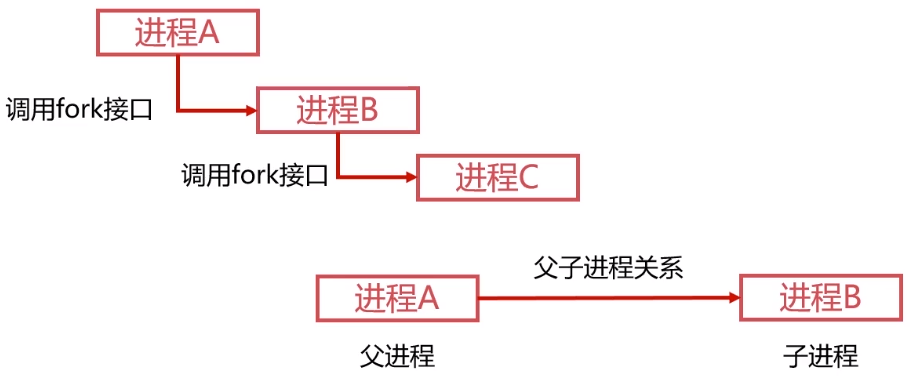

# Linux的进程管理

## Linux进程的相关概念

### 进程的类型

**前台进程**

- 前台进程就是具有终端，可以和用户交互的进程。

**后台进程**

- 与前台进程相对，没有占用终端的就是后台进程。
- 后台程序基本上不和用户交互，优先级比前台进程低。
- 将需要执行的命令以`&`符号结束即启动后台进程。

**守护进程**

- 守护进程是特殊的后台进程。
- 很多守护进程在系统引导的时候启动，一直运行直到系统关闭。
- 进程名称以`d`结尾的一般都是守护进程。

### 进程的标记

**进程ID**

- 进程`ID`是进程的唯一标记，每个进程拥有不同的`ID`。
- 进程`ID`表现为一个非负整数，最大值由操作系统限定。

- `ID`为`0`的进程为`idle`进程，是系统创建的第一个进程。
- `ID`为`1`的进程为`init`进程，是`0`号进程的子进程，完成系统初始化。
- `init`进程是所有用户进程的祖先进程。

**进程的状态标记**

状态符号 | 状态说明
:-: | :-:
R | TASK_RUNNING，运行状态
S | TASK_INTERRUPTIBLE，睡眠状态
D | TASK_UNINTERRUPTIBLE，IO等待的睡眠状态
T | TASK_STOPPED，暂停状态
Z | TASK_DEAD/EXIT_ZOMBIE，退出状态/僵尸进程

## 操作Linux进程的相关命令

### ps

- `ps`命令常用于显示当前进程的状态。
- `ps`命令常配合`aux`参数或`ef`参数和`grep`命令检索特定进程。

### kill

- `kill`命令发送指定信号给进程。
- `kill -l`可以查看操作系统支持的信号。
- 只有`SIGKILL 9`信号可以无条件终止进程，其他信号进程有权忽略。