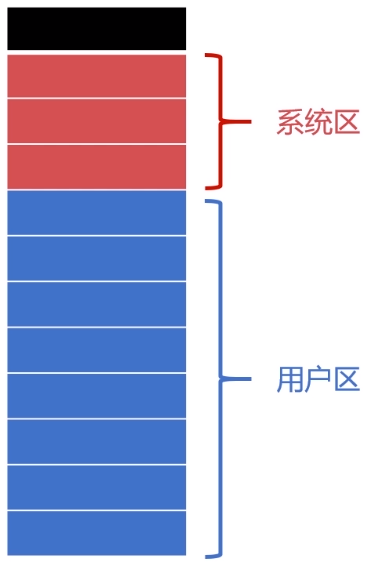
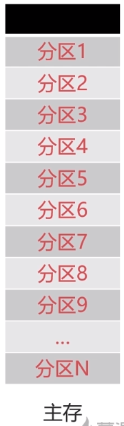
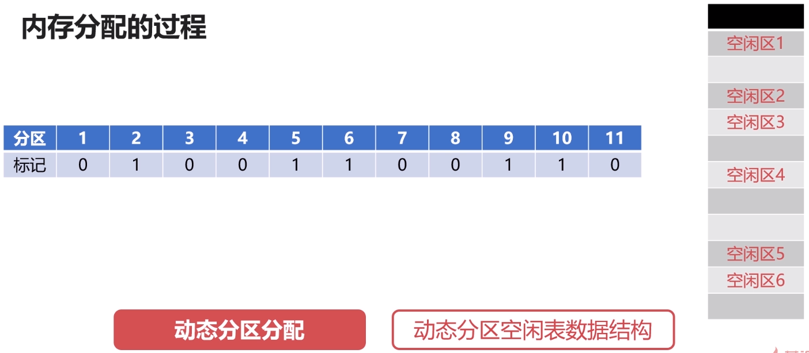
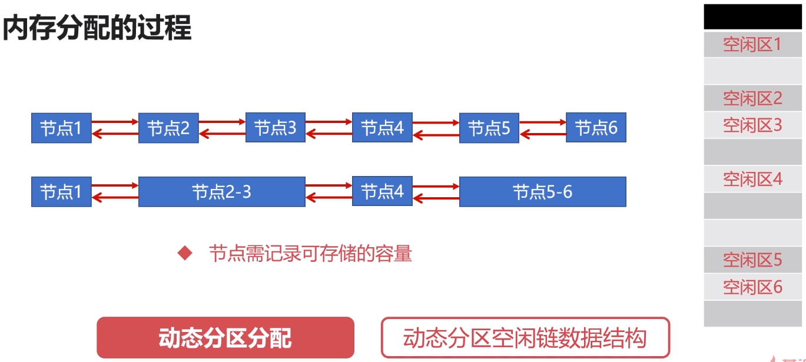
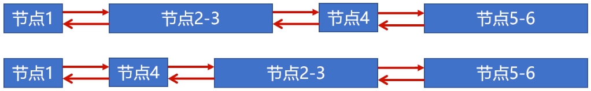
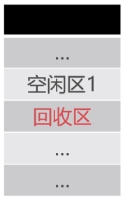
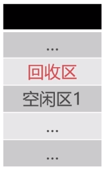
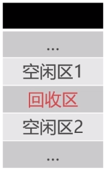

# 存储管理之内存分配与回收

## 内存分配的过程

### 单一连续分配

- 单一连续分配是最简单的内存分配方式。
- 只能在单用户、单进程的操作系统中使用。

### 固定分区分配

- 固定分区分配是支持多道程序的最简单存储分配方式。
- 内存空间被划分为若干固定大小的区域。
- 每个分区只提供给一个程序使用，互不干扰。

### 动态分区分配

- 根据进程实际需要，动态分配内存空间。
- 相关数据结构、分配算法。

**首次适应算法(FF)**

- 分配内存时从开始顺序查找适合内存区。
- 若没有合适的空闲区，则该次分配失败。
- 每次从头部开始，使得头部地址空间不断被划分。

**最佳适应算法(BF)**

- 最佳适应算法要求空闲区链表按照容量大小排序。
- 遍历空闲区链表找到最佳合适空闲区。

**快速适应算法(QF)**

- 快速适应算法要求有多个空闲区链表。
- 每个空闲区链表存储一种容量的空闲区。

## 内存回收的过程

- 不需要新建空闲链表节点。
- 只需要把空闲区`1`的容量增大为空闲区即可。

- 将回收区与空闲区合并。
- 新的空闲区使用回收区的地址。

- 将空闲区`1`、空闲区`2`和回收区合并。
- 新的空闲区使用空闲区`1`的地址。

- 为回收区创建新的空闲节点。
- 插入到相应的空闲区链表中去。