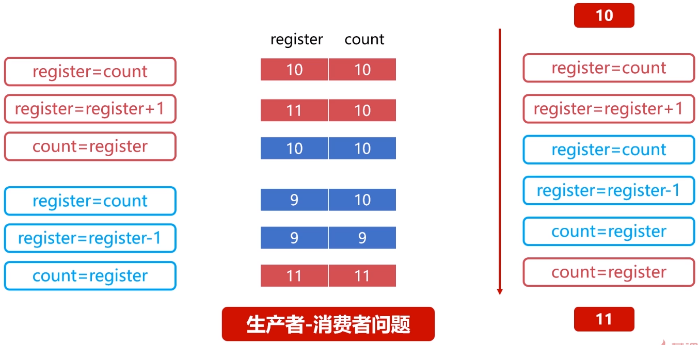
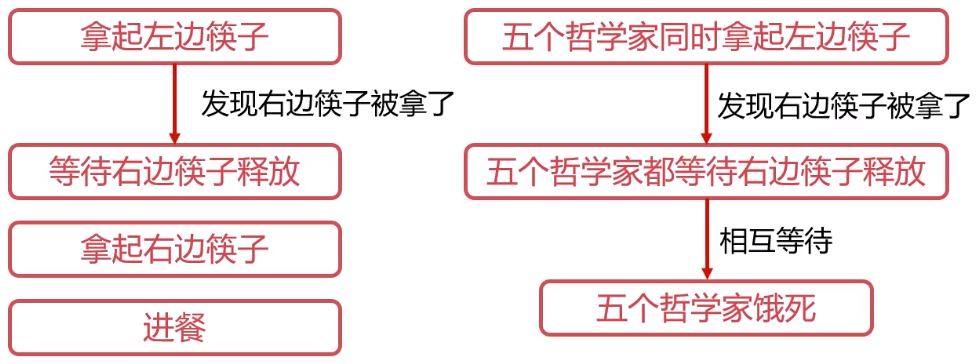

# 进程管理之进程同步

## 为什么需要进程间同步

### 生产者消费者问题

有一群生产者进程在生产产品，并将这些产品提供给消费者进程进行消费，生产者进程和消费者
进程可以并发执行，在两者之间设置了一个具有`n`可缓冲区的缓冲池，生产者进程需要将所生产
的产品放到一个缓冲区中，消费者进程可以从缓冲区取走产品消费。

缓冲区是在`Cache`上的，操作缓存需要以下步骤：

1. register = count
2. register = register + 1
3. count = register

### 哲学家进餐问题

有五个哲学家，他们的生活方式是交替地进行思考和进餐，哲学家们共同使用一张圆桌，分别坐
在周围的五张椅子上，在圆桌上有五个碗和五支筷子。平时哲学家们只进行思考，饥饿时则试图
取靠近他们的左、右两支筷子，只有两支筷子都被他拿到的时候就能进餐，进餐完毕之后，放下
左右筷子继续思考。

1. 拿起左边筷子
2. 拿起右边筷子
3. 进餐

### 需要进程间的同步

- 对竞争资源在多进程间进行使用次序的协调。
- 使得并发执行的多个进程之间可以有效使用资源和相互合作。

## 进程间同步的原则

临界资源指的是一些虽作为共享资源却又无法同时被多个线程共同访问的共享资源。当有进程在使用临界资源时，其他进程必须依据操作系统的同步机制等待占用进程释放该共享资源才可重新竞争使用共享资源。

- 空闲让进：资源无占用，允许使用。
- 忙则等待：资源有占用，请求进程等待。
- 有限等待：保证有限等待时间能够使用资源。
- 让权等待：等待时，进程需要让出`CPU`。

### 进程同步方法

- 消息队列
- 共享存储
- 信号量

## 线程同步

当多线程并发时，进程内多线程也需要同步。

### 线程同步方法

- 互斥量
- 读写锁
- 自旋锁
- 条件变量