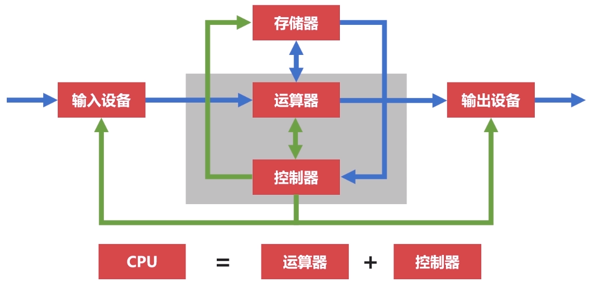
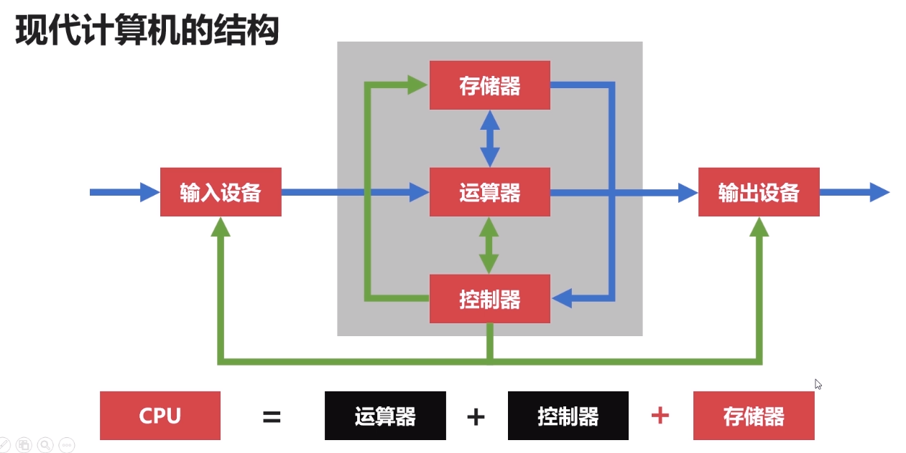

# 计算机的体系与结构

## 冯诺依曼体系

将程序指令和数据一起存储的计算机设计概念结构。

### 体系诞生

早期计算机仅包含固定用途程序，改变程序需要更改计算机结构，重新设计电路。

故：将程序存储取来，并设计通用电路。

核心：存储程序指令，设计通用电路。

### 计算机组成

1. 存储器：存储运行的程序，存储运行所需的数据。
2. 控制器：控制各组件工作。
3. 运算器：运行算数运算和逻辑运算。
4. 输入设备
5. 输出设备

现代计算机都是冯诺依曼计算机。

### 功能

1. 能够把需要的程序和数据送至计算机中。
2. 能够长期记忆程序、数据、中间结果及最终运算结果的能力。
3. 能够具备算数、逻辑运算和数据传送等数据加工处理的能力。
4. 能够按照要求将处理结果输出给用户。

### 瓶颈

冯诺依曼瓶颈：因`CPU`与存储器相分离，在`CPU`与存储器之间的数据流量成为了效率非常严重的限制，`CPU`经常空转等待数据传输。

## 现代计算机的结构

现代计算机在冯诺依曼体系结构基础上进行修改，解决`CPU`与存储设备之间的性能差异问题。

将存储器归入`CPU`，此处的存储器就是现在常说的`CPU`多级缓存，缓存是使用和`CPU`同样的`14`纳米工艺制造的硅半导体，成本高昂且非常占用`CPU`核心面积，故不能做成大容量。