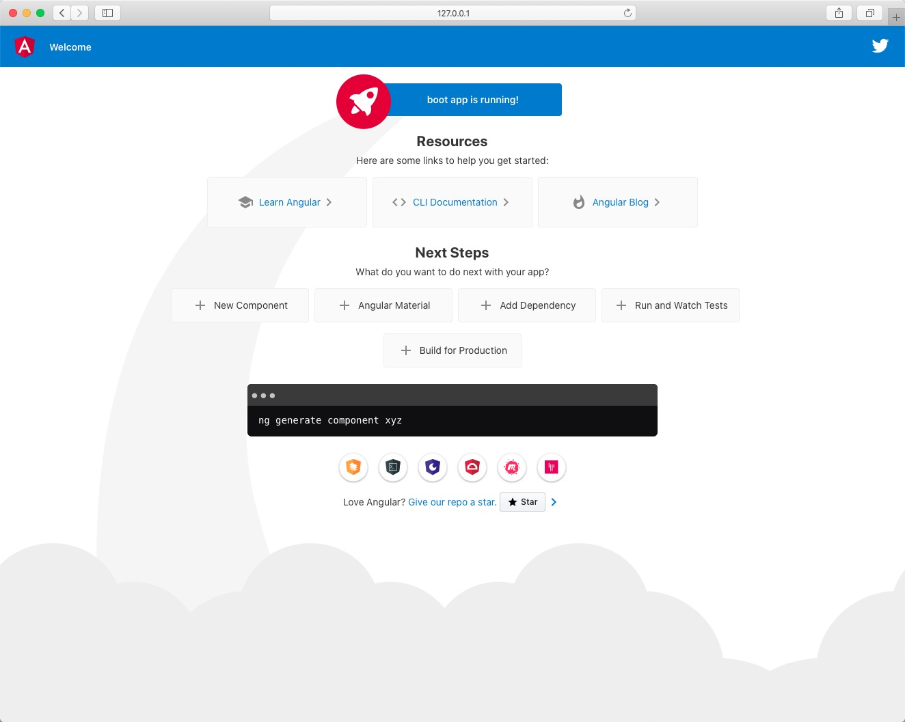
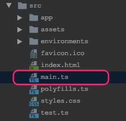
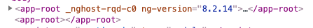

# 问题描述

在软件开发越来越工程化的时代，雨后春笋般的开发工具使得开发越来越自动化，越来越简单。

使用`Angular CLI`，我们可以通过如下命令快速初始化一个简单的`Angular`应用并启动。

```shell
ng new boot
ng serve
```

打开浏览器，访问`http://127.0.0.1:4200`，即访问到初始化的`Angular`应用。



用`WebStorm`打开项目，`src`文件夹下的文件众多，让人眼花缭乱，那究竟，一个`Angular`应用是怎么启动的呢？


# 启动

`main.ts`文件负责整个`Angular`应用的启动。



打开`main.ts`，找到如下代码：

```typescript
platformBrowserDynamic().bootstrapModule(AppModule)
  .catch(err => console.error(err));
```

调用从`@angular/platform-browser-dynamic`包中导入的`platformBrowserDynamic`方法，该方法声明`Angular`应用在浏览器`(Browser)`环境中启动。因为`Angular`能被应用在`JavaScript`环境中，而不仅仅是浏览器。

```typescript
import { platformBrowserDynamic } from '@angular/platform-browser-dynamic';
```

查看该方法的声明，其返回值类型为`PlatformRef`，即平台引用。

```typescript
export declare const platformBrowserDynamic: (extraProviders?: StaticProvider[] | undefined) => PlatformRef;
```

初步猜想，调用`platformBrowserDynamic`方法，返回了适用于浏览器平台的`PlatformRef`对象，可能调用其他方法，返回的`PlatformRef`对象适用于其他平台。

再调用`PlatformRef`对象的`bootstrapModule`方法，启动`AppModule`模块。

```typescript
.bootstrapModule(AppModule)
```

也就是说，`AppModule`是当前程序的入口模块/根模块。

再去看`AppModule`模块，`@NgModule`注解中`bootstrap`声明了该模块中需要启动的组件，此处为`AppComponent`。

```typescript
@NgModule({
  declarations: [
    AppComponent
  ],
  imports: [
    BrowserModule
  ],
  providers: [],
  bootstrap: [AppComponent]
})
export class AppModule { }
```

`Angular`继续编译组件`AppComponent`。

```typescript
@Component({
  selector: 'app-root',
  templateUrl: './app.component.html',
  styleUrls: ['./app.component.css']
})
export class AppComponent {
  title = 'boot';
}
```

根据组件中声明的`app-root`选择器，去`index.html`中编译`<app-root></app-root>`标签。

```html
<body>
  <app-root></app-root>
</body>
```

`bootstrap`中声明的启动组件在模块加载时首先编译，根据其选择器去匹配`index.html`中的标签，如果匹配失败，会出现选择器不匹配错误。

```
ERROR Error: The selector "app-root" did not match any elements
```

所以如果在`index.html`中有多个根标签需要编译的话，完全可以设计多个`bootstrap`组件。

```typescript
bootstrap: [AppComponent, App2Component]
```

如果当`index.html`有多个标签匹配的时候。

```html
<body>
  <app-root></app-root>
  <app-root></app-root>
</body>
```

`Angular`只会编译第一个匹配的标签。



创建`AppComponent`，执行组件，其组件内可能也用到了其他组件，类似这样，`Angular`会继续进行编译。

```html
<body>
  <app-root compiled>
    <app-header></app-header>
    <app-body></app-body>
    <app-footer></app-footer>
  </app-root>
</body>
```

所以，`AppComponent`组件的创建触发一系列组件的创建并形成组件树。

总之，`Angular`从根模块的根组件开始编译整个组件树从而启动整个应用。
