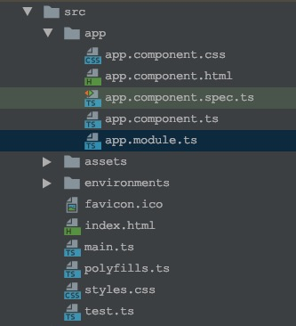

# 问题描述

在软件开发越来越工程化的时代，雨后春笋般的开发工具使得开发越来越自动化，越来越简单。

使用`Angular CLI`，我们可以通过如下命令快速初始化一个简单的`Angular`应用并启动。

```shell
➜ ng new boot
➜ ng serve
```

打开浏览器，访问`http://127.0.0.1:4200`，即访问到初始化的`Angular`应用。


用`WebStorm`打开项目，`src`文件夹下的文件众多，让人眼花缭乱，那究竟，一个`Angular`应用是怎么启动的呢？


