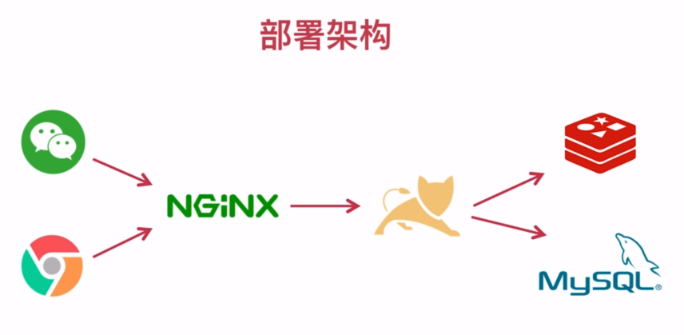

# 项目架构

## 部署架构

- 整个系统交由`NGINX`托管，`NGINX`转发`api`请求到`Tomcat`。

- `Tomcat`分布式部署，`NGINX`负载均衡。

- 如果数据缓存，从`Redis`中查询数据；如果数据未缓存，从`MySQL`中查询数据。

## 微服务架构

### 阿里系

- 服务治理：`Dubbo`
- 服务注册中心：`Zookeeper`
- 基础框架：`SpringMVC`或`SpringBoot`

### Spring Cloud 系

- 服务治理：`Spring Cloud`
- 服务注册中心：`Netflix Eureka`
- 基础框架：`SpringBoot`