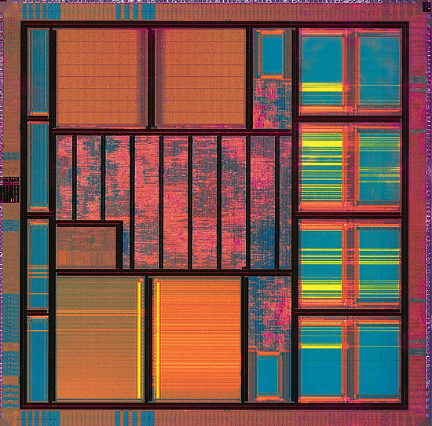

# 计算机的发展历史

## 计算机发展的四个阶段

### 第一阶段 [1946 ~ 1957] 电子管计算机

**历史**

第二次世界大战，英国为了解密德国海军的密文，设计了全世界第一台电子管计算机。

美国，埃尼阿克`(ENIAC)`计算机。战争中飞机、火箭的射击参数需要经过上千次计算，设计计算机为了使计算更准确。运算效率是手工运算的`20`万倍。

**特点**

- 集成度低，空间占用大。
- 功耗高，运算速度慢。
- 操作复杂，更换程序时需要重新接线。

### 第二阶段 [1957 ~ 1964] 晶体管计算机

**历史**

贝尔实验室的三个科学家发明了晶体管。

`TX-0`：全世界第一台晶体管计算机，诞生于麻省理工学院林肯实验室。

`PDP-1`：当时性能最高的晶体管计算机，`4K`内存，每秒执行`20`万条指令，配备`512×512`的显示器。

**特点**

- 集成度相对较高，空间占用相对较小。
- 功耗相对较低，运行速度较快。
- 操作相对简单，交互更加方便。

### 第三阶段 [1964 ~ 1980] 集成电路计算机

德州仪器的工程师发明了集成电路`(IC)`。

计算机变得更小，功耗变得更低，计算速度变得更快。

`IBM`计算机`7094`与`1401`主打功能不同，且相互无法兼容。推出兼容产品`System/360`，这就是操作系统的雏形。

### 第四阶段 [1980 ~ 现在] 超大规模集成电路计算机

一个芯片集成了上百万的晶体管。

速度更快，体积更小，价格更低，更能被大众接受。

用途丰富：文本处理、表格处理、高交互的游戏与应用。